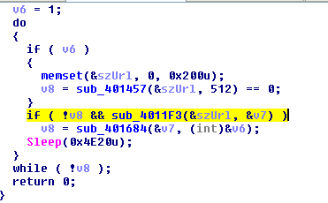

Bài viết được viết ngày 29/9/2025 và mai chưa phải là ngày kiểm tra báo cáo bài này nên mình sẽ làm trước.
# Ques 1;What hard-coded elements are used in the initial beacon? What elements, if any, would make a good signature?

Sử dụng wireshark 32 bit để bắt gói tin:

Ở đây mình chưa làm lab 14.1 nên mình sẽ không so sánh được nhiều, mình sẽ tham khảo hướng dẫn:

Có 1 số thành phần đã được biến đổi:
Accept-Language
UA-CPU
User-Agent
Bạn sẽ để ý ngay là phần `User-Agent` nó không bị lặp lại, nếu là mình mình sẽ nghĩ ngay đây là lỗi cấu hình của con malware này, có lẽ nào nó đã chỉnh sửa header http không. Đây có thể là 1  good signature

Tiếp tục hãy mở trong Ida và nhìn vào `String-Windows` thì sẽ thấy 1 số điều thú vị khá giống phán đoán từ trước:

Đó là các thông tin đã được viết sẵn, là thông tin tĩnh được tạo ra để viết vào http header request và có 1 `url:http://www.practicalmalwareanalysis.com/start.htm `, khả năng đây là C2 server. Có lẽ ảnh này là câu trả lời cho câu 1.
# Ques 2: What elements of the initial beacon may not be conducive to a longlasting signature?
Nếu đọc câu hỏi và đã đọc lời giải =)) thì theo suy nghĩ đơn giản của mình thì rất có thể là url, vì url 1 khi đã bị phát hiện thì sẽ vào malicious website, rất có thể sẽ bị đánh sập.

Tiếp tục truy cập ida
Tìm reference của url trên :

Thì ta thấy nó thuộc về 1 hàm tên là `sub_401457`, hàm này dùng với quyền đọc. dùng `CreateFileA`  với tham số cần chú ý là `dwCreationDisposition = 3    ; OPEN_EXISTING`, giá trị trả về sẽ được lưu vào thanh ghi `eax` , và nó sẽ so sánh `mov     [ebp+hFile], eax
cmp     [ebp+hFile], 0FFFFFFFFh` , mục đích so sánh như vậy để xem file `C:\\autobat.exe` nó đã tồn tại chưa


Khi file chưa được tạo thì sẽ gọi đến `sub_401372`

Mục đích chính của file này là:
 -  `strcpy(&Buffer, a1);` : Copy url vào buffer = `url` 
 - Tạo file với  đường dẫn tới file là `FileName` = `'C:\autobat.exe',0`
 - Ghi vào đường dẫn url vào file.
 - Nếu thành công thì return `eax = 1` , 
 
Nguyên nhân làm vậy thì giải thích ở chỗ so sánh `test    eax, eax` sẽ sai sẽ nhảy đến block sai, sau đó lại có lệnh gọi lại `call    sub_401457` 1 lần nữa: 

Lúc này ta sẽ sang nhánh đúng của lệnh so sánh. Nhánh này có mục đích để lấy handle từ `FileName` và đọc nội dung vào buffer sẽ dùng hàm `sub_4011F3`, buffer lúc trước chính là biến ` lpszUrl`. 

Nếu ta tìm referrence của hàm `sub_401372` thì thấy nó được gọi trong hàm `sub_401651`, xong sau đó lại tìm reference của `sub_401651` thì ta đến đây `sub_401684` ![]

Có vẻ như đây sử dụng `strtok` để phân tách các chuỗi qua ký tự `/` . Xong sau đó sẽ dựa vào biến `v2` vừa tách để tìm các case theo các chữ cái như trong hình. Cái muốn nói ở đây là  `sub_401372` đã được gọi bằng 1 cách khác cũng như là có thể ghi url vào đường dẫn file `autobat.exe` bằng 1 cách khác.

Từ đây ta có thể rút ra 1 số kết luận :
- Doamin , URL, host, GET request không phù hợp làm  dấu hiệu lâu dài 
- Bằng cách chỉnh domain , nội dung trong file `autobat.exe` ta có thể ngăn chặn C2 server.

# Ques 3 :How does the malware obtain commands? What example from the chapter used a similar methodology? What are the advantages of this technique?
Trong hàm `sub_4011F3` ta có. Buffer ở `sub_4011F3` dùng để lưu dữ liệu của lệnh InternetReadFile khi đọc respone từ đường link url trả về.


Ở đây ta thấy ở vòng lặp for có hàm  `for ( i = strstr(&Buffer, aNo); i; i = strstr(i + 1, aNo_0) `. Khi vào function strstr thì mình đã trace theo điều kiện đúng thì thấy kiểm kiếm chuỗi con `aNo` ở trong `Buffer`. Nếu tìm thấy sẽ trả về con trỏ tới phần tử đầu tiên của `aNO` trong chuỗi `Buffer`.Tóm lại là nó tìm kiếm phần từ bắt đầu bằng  `<no`

Tiếp tục ta xem xét hàm `sub_401000(i, (char *)lpszUrl, a2)` thì thấy nó đang so sánh tiếp các ký tự ở chuỗi Buffer 

Sau khi ghép lại ta thấy nó đang tìm kiếm xem buffer có chuỗi `<noscript>`, tiếp theo ta thấy có hàm `v7 = strrchr(&v6, '/')` sẽ tìm kiếm trong chuỗi có `/ /` không và trả về con trỏ tới cuối chuỗi con đó.

Và có 1 số hàm nữa, sau đó có thể  kết luận đây là 1 chuỗi string mẫu
```<noscript><DYNAMICCONTENT>http://www.practicalmalwareanalysis.com/<COMMAND>/<ARG>96'```

Sau đó ta sẽ ngó qua hàm `sub_401684` sẽ chạy để 
cái respone mẫu ở trên , để tìm kiếm chạy 3 hàm con tùy vào biến `<COMMAND>` nhận được.

Điều này có thể kết luận rằng malware nhận được code mẫu thông qua dấu hiệu là `<noscript>` tags , rất giống với Lab06-02.exe. Lợi ích của kỹ thuật này là nó so khớp commmand từ bên trong 1 domain web. Vì vậy rất khó phát hiện ra dấu vết hay malware nếu không xem xét kĩ lưỡng trang web domain.

Ngoài lề 1 ít là đang phân tích `sub_401000` thì cái code này mình thấy là khá là key 
```asm
 && (strcpy(&v6, a2), v7 = strrchr(&v6, '/'), *v7 = 0, (v7 = strstr(v8, &v6)) != 0)
    && (v3 = strlen(&v6), v7 += v3, (v5 = strstr(v7, a96)) != 0) )
  {
    *v5 = 0;
    strcpy(a3, v7);
    result = 1;
  }
```
Đầu tiên:
`(strcpy(&v6, a2)`: để copy chuỗi url `aHttpWww_practi db 'http://www.practicalmalwareanalysis.com/start.htm',0` vào v6 

`v7 = strrchr(&v6, '/')`: để tìm ngược từ cuối chuỗi url lên đến '/' gần nhất là (/start.htm)

`*v7 = 0` :để chuyển '/' thành '0x00' chính là phần tử kết thúc chuỗi. có nghĩa là url của v6 ban đầu bây giờ chỉ còn `aHttpWww_practi db 'http://www.practicalmalwareanalysis.com',0`

`(v7 = strstr(v8, &v6)) != 0`: hàm này để tìm v6 trong v8, v8 ở đây là nội dung trả về từ C2 server có dạng ở string mẫu phía trên mình đã suy đoán ra.

`(v3 = strlen(&v6), v7 += v3, (v5 = strstr(v7, a96)) != 0) )`: tiếp theo v3 = độ dài v6 mới , sau đó v7 += v3 sẽ nhảy tới cuối chuỗi v6. Sau đó sẽ tìm kiếm chuỗi a96 bắt đầu từ vị trí v7 đến khi kết thúc chuỗi 

Sau đó nếu thỏa mãn các điều kiện thì kí tự mà v5 trỏ đến = 0 có thể đây là kết thúc chuỗi .

# Ques 4: When the malware receives input, what checks are performed on the input to determine whether it is a valid command? How does the attacker hide the list of commands the malware is searching for?
Dựa vào phân tích ở trên, ta kết luận lại là malware nhận input từ C2 và tìm kiếm sự tồn tại của chuỗi `<noscript> ` trong doamin trẻ về mong muốn , sau đó là 1 command, và số 96'.

Tiếp theo ta sẽ khám phá tiếp hàm  `sub_401684` sau khi kết thúc , chạy xong lệnh if `if ( !v8 && sub_4011F3(&szUrl, &v7) )`

Ta thấy có sử dụng hàm `strtok` để tách các token ra từ URL mà mình dự đoán. 

Cái này mình sẽ nói rõ hơn url ở đây không phải cái đầy đủ . Nó đang so sánh a1 để chia lấy các token. thì a1 ở đây ta phải tìm ngược lại a1 là tham số ở đâu

a1 chính là &v7, mà trong hàm  `sub_4011F3` &v7 chính là a2, sau đó trong `sub_401000` thì tham số a2 chính là biến a3, a3 được lấy nội dung của v7, mà v7 sau khi biến đổi đã là con trỏ trỏ đến vị trí cuối cùng của chuỗi `http://www.practicalmalwareanalysis.com`. Hãy xem lại string mẫu dự đoán mà C2 trả về:
`<noscript><DYNAMICCONTENT>http://www.practicalmalwareanalysis.com/<COMMAND>/<ARG>` 
thì v7 đang ở ngay cạnh command, thiếu `96'` vì nó đã cho trở thành bằng 0 ở `v5=0` trong hàm  `sub_4011F3`


thì lúc này chuỗi còn lại mà v7 đang trỏ là `/<COMMAND>/<ARG>` nên ` v6 = 0;
  strcpy(v5, "/");
  v2 = strtok(a1, v5);
  v4 = strtok(0, v5);`
  v2 lúc này sẽ là `COMMMAND` , V4 LÀ `<ARG>`

Quay lại với hàm `sub_401684`, hãy nhìn vào assembly hoặc mã giả 

thì ta có thể thấy các phần tử bắt đầu bằng các kí tự `d,s,n,r` thì sẽ chạy giống như các command để ra lệnh cho malware. Thật ra cái này mình thấy không đúng lắm , vì nếu đọc assembly ở 

Thì phân tích thấy các ký từ bắt đầu của block từ `d -> t` đều được vì không quá 16 từ `d`. Sau đó khoảng cách đó được truyền vào tham chiếu trong dữ liệu `mov     cl, ds:byte_40173E[edx]`

Ở đây có 5 trường hơp từ 0 -> 4 tương ứng với các hàm ở 


Nhưng ở sau tham chiếu 0-4 ta tập trung vài 
ví dụ nếu k/c =0 =`d`, k/c=10 =`n`, k/c=14=`r`, k/c=15=`r` vì đếm từ vị trí 0-15. kiểu như là nó quy về còn 5 trường hợp.
# Ques 5:What type of encoding is used for command arguments? How is it different from Base64, and what advantages or disadvantages does it offer?
Ta hãy xem xét hàm `loc_40170E` sẽ chạy 1 hàm `‘sub_401651` rồi sau đó sẽ gọi hàm decode `sub_401147`. Đây là 1 hàm custom mã hóa hoặc giải mã gì đấy.

Đầu tiên nó sẽ so sánh độ dài của argument có chia hết cho 2 không. Nếu chia hết cho 2 thì tiếp tục.

nhìn qua mình thấy hình như cái này chỉ mã hóa các phần tử chẵn.

Nếu chúng ta nhìn qua đây khá giống chuỗi index của Base64 nhưng lại không đủ kí tự và giá trị. Khi nhìn qua đoạn code ở ảnh trước thì ta thấy hàm lấy (2 hay 1 mình cũng không chắc chắn =)) giải thì là 2 còn mình thấy code giống 1 nhưng muốn theo index thế kia khả năng là 2 kí tự thành number bằng hàm  `atoi` rồi dùng làm index để lấy chuỗi đã xác định kia.
`/abcdefghijklmnopqrstuvwxyz0123456789:.`
Đây là một loại mã hóa - giải mã hóa không theo tiêu chuẩn nên không dễ để tìm ra dấu vêt, phải dịch ngược để thất. Còn về bất lợi là nó khá đơn giản.
# Ques 6: What commands are available to this malware?
Chúng ta lại quay về hàm `sub_401684`. Hãy nhớ lại câu hỏi 4 thì ta có thể tóm tắt lại rằng:
- Case 0 (d): loc_4016E9
- Case 1 (n): loc_4016F7
- Case 2 (r): loc_40170E
- Case 3 (s): loc_401700
- Case 4 (other): loc_401723

Khi tìm hiểu sẽ thấy có 3 option gọi ra hàm con, trong đó có 1 hàm dùng để update biến để ngắt vòng lặp C2 và cả chương trình. Dưới đây là các chương trình con được gọi tương ứng:
d: sub_401565
n: NO SUBROUTINE (quit)
r: sub_401651
s: sub_401613


Khi bắt đầu phân tích ` sub_401565 (d)` thì ta có thể thấy đã sử dụng arument trước khi tải và chạy 1 phần mềm khác.Hàm cũng gọi đến `sub_401147` đã phân tích trước đó 


Tiếp tục phân tích ` sub_401613 (s)` thì nó đơn giản là để sleep , Nếu có arugument truyền qua bao nhiêu thì ngủ từng đấy mili giấy, nếu không có thì mặc định ngủ 20,000 milliseconds


Tiếp theo là đến hàm ` sub_401651 (r)` gọi đến  `sub_401147` để decode url được cung cấp argument, sau đó gọi hàm `‘sub_401372` cái mà chúng ta đã phát hiện ở câu 2 có nhiệm vụ update C2 file, ghi cấu hình mới vào file `autobat.exe`

# Ques 7:What is the purpose of this malware?
Dựa vào phân tích của các câu trước ta có thể nói rằng đây là loại malware dropper AKA a ‘Downloaders and Launcher’. Malware này khác malware truyền thống khi có khả năng tự tồn tại để drop malware trước khi tự xóa chính mình còn malware này nó sẽ thiết lập sự dai dẳng, bám trụ cho các malware và các lệnh C2 tiếp theo được thả.

# Quest 8:This chapter introduced the idea of targeting different areas of code with independent signatures (where possible) in order to add resiliency to network indicators. What are some distinct areas of code or configuration data that can be targeted by network signatures?
Malware này có 1 số điểm yếu đó là cơ chế mã hóa yếu, nhiều dữ liệu tĩnh được tìm ở string window, Lỗi ở User-agent, domain name tự cấu hình. Chúng ta có thể dùng được các dấu hiệu này để tạo ra các rules ví dụ như rule của IDS như snort để phát hiện ra malware cũng như C2 server reposne. Chúng ta sẽ tập trung vào các chữ kí mạng như cờ hiệu của malware cũng như các commnad lần lượt được gửi về bởi các web C2 server.
 # Ques 9:What set of signatures should be used for this malware?
 [link](https://ablaze-clownfish-3ca.notion.site/question-9-What-set-of-signatures-should-be-used-for-this-malware-2727d86bbb2580c1b85df0d1fa30b937?source=copy_link)

 Đến đây là kết thúc rồi. Cảm ơn bạn đã đọc lab!