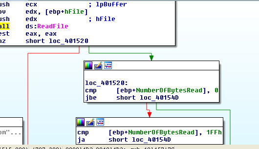

Bài viết được viết ngày 29/9/2025 và mai chưa phải là ngày kiểm tra báo cáo bài này nên mình sẽ làm trước.
# Ques 1;What hard-coded elements are used in the initial beacon? What elements, if any, would make a good signature?

Sử dụng wireshark 32 bit để bắt gói tin:

Ở đây mình chưa làm lab 14.1 nên mình sẽ không so sánh được nhiều, mình sẽ tham khảo hướng dẫn:

Có 1 số thành phần đã được biến đổi:
Accept-Language
UA-CPU
User-Agent
Bạn sẽ để ý ngay là phần `User-Agent` nó không bị lặp lại, nếu là mình mình sẽ nghĩ ngay đây là lỗi cấu hình của con malware này, có lẽ nào nó đã chỉnh sửa header http không. Đây có thể là 1  good signature

Tiếp tục hãy mở trong Ida và nhìn vào `String-Windows` thì sẽ thấy 1 số điều thú vị khá giống phán đoán từ trước:

Đó là các thông tin đã được viết sẵn, là thông tin tĩnh được tạo ra để viết vào http header request và có 1 `url:http://www.practicalmalwareanalysis.com/start.htm `, khả năng đây là C2 server. Có lẽ ảnh này là câu trả lời cho câu 1.
# What elements of the initial beacon may not be conducive to a longlasting signature?
Nếu đọc câu hỏi và đã đọc lời giải =)) thì theo suy nghĩ đơn giản của mình thì rất có thể là url, vì url 1 khi đã bị phát hiện thì sẽ vào malicious website, rất có thể sẽ bị đánh sập.

Tiếp tục truy cập ida
Tìm reference của url trên :

Thì ta thấy nó thuộc về 1 hàm tên là `sub_401457`, hàm này dùng với quyền đọc. dùng `CreateFileA`  với tham số cần chú ý là `dwCreationDisposition = 3    ; OPEN_EXISTING`, giá trị trả về sẽ được lưu vào thanh ghi `eax` , và nó sẽ so sánh `mov     [ebp+hFile], eax
cmp     [ebp+hFile], 0FFFFFFFFh` , mục đích so sánh như vậy để xem file `C:\\autobat.exe` nó đã tồn tại chưa

Khi file chưa được tạo thì sẽ gọi đến `sub_401372`

Mục đích chính của file này là:
 -  `strcpy(&Buffer, a1);` : Copy url vào buffer = `url` 
 - Tạo file với  đường dẫn tới file là `FileName` = `'C:\autobat.exe',0`
 - Ghi vào đường dẫn url vào file.
 - Nếu thành công thì return `eax = 1` , 
 
Nguyên nhân làm vậy thì giải thích ở chỗ so sánh `test    eax, eax` sẽ sai sẽ nhảy đến block sai, sau đó lại có lệnh gọi lại `call    sub_401457` 1 lần nữa: 

Lúc này ta sẽ sang nhánh đúng của lệnh so sánh. Nhánh này có mục đích để lấy handle từ `FileName` và đọc nội dung vào buffer sẽ dùng hàm `sub_4011F3`, buffer lúc trước chính là biến ` lpszUrl`. 

Trong hàm `sub_4011F3` ta có. Buffer ở `sub_4011F3` dùng để lưu dữ liệu của lệnh InternetReadFile khi đọc respone từ đường link url trả về.

