# Ques 1:What anti-disassembly technique is used in this binary?
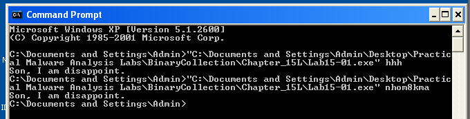
Ở đây ta thấy malware này command line program nhận thêm 1 đối số. Nếu đúng thì in ra `goood job` , sai in ra `son, i am disappoint`, bằng chứng thêm là nhìn vào strings window
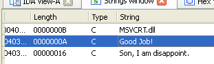

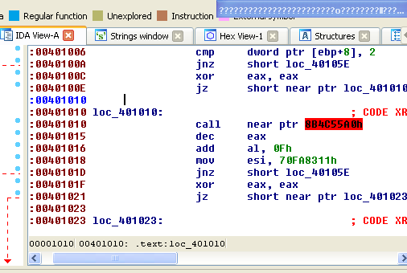
Vừa vào chương trình ta đã thấy ngay 1 số kỹ thuật anti-disassembly khi nhìn thấy data được đánh dấu như text. có các lệnh câu nhảy đến địa chỉ không tồn tại

Vào `Option -> General` rồi chỉnh `Number of opcode` = 5 , sẽ cũng cấp cho ta 1 số thông tin 
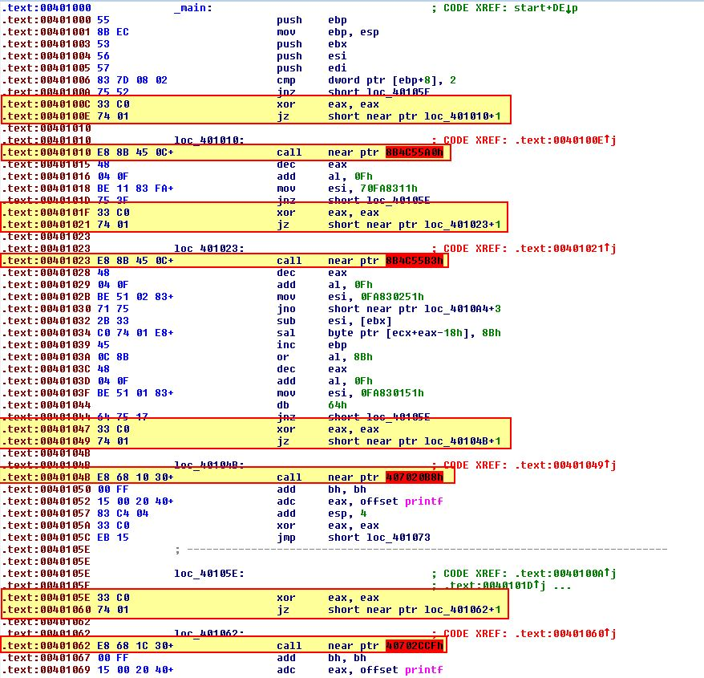
Ở trên ảnh ta thấy có 4 lần `Xor eax, eax` lúc này `zero flag` sẽ được bật và sau đó là câu lệnh `jz` luôn được thực hiện, nhưng ida sẽ đánh giá các lệnh của điều kiện sai trước và điều đó gây ra vấn đề

# Ques 2: What rogue opcode is the disassembly tricked into disassembling?
Ở lệnh call nhảy đến vị trí không tồn tại , ta sẽ bôi đen địa chỉ rồi undefined nó.
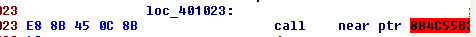 Lúc đầu ta thấy lệnh câu phần opcode có 5 bài , ta sẽ bỏ byte đầu là `0xE8` đi rồi reanalyze bằng cách chuột phải chọn `analyze selected code`lại 4 byte còn lại `8Bh 45h 0Ch 8Bh`  sẽ được như hình dưới 
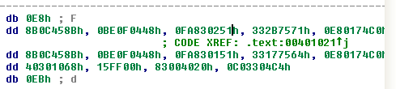
Tiếp tục bỏ `0xE8` rồi bôi đen các byte còn lại rồi reanalyze lại lần nữa. Chọn `Force` rồi chọn `no` trong option `undefine ....` ta sẽ được kết quả như ảnh:
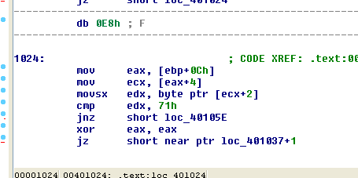

Vậy kết luận của là opcode bất thường là `0xE8`

# Ques 3: How many times is this technique used?

Hãy quay lại với chương trình cũ chưa sửa:
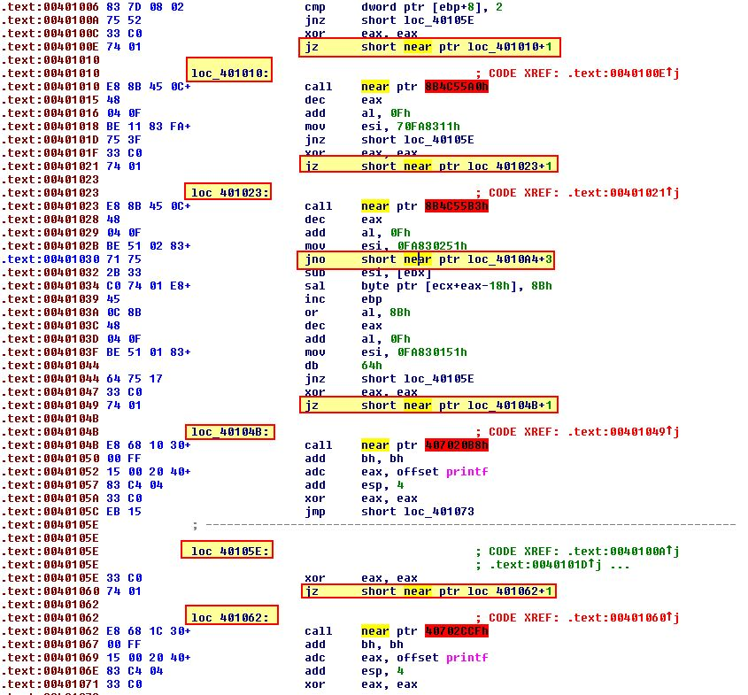
Ta thấy tổng cộng có 5 lần
Để kiểm chứng ta bắt đầu làm lại như ở trên cho từng phần ở trên là 5 lần. Lúc đó ta sẽ thấy chương trình hợp lý hơn
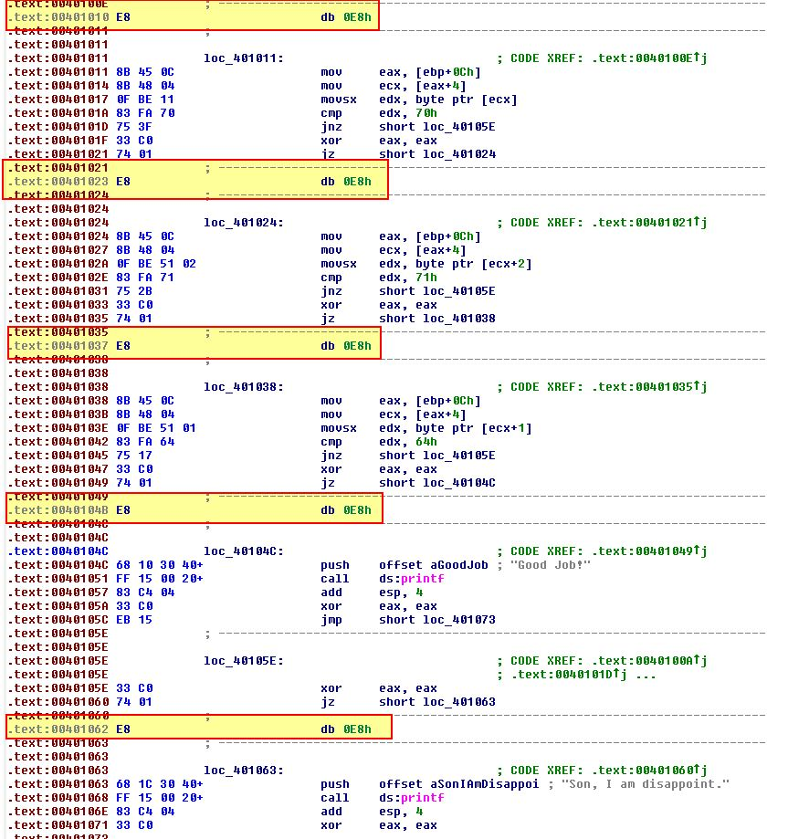

Từ đây có thể chắc chắn rằng kĩ thuật này đã được sử dụng 5 lần.

# Ques 4: What command-line argument will cause the program to print “Good Job!”?
Ở bản IDA của tôi không có chức năng tạo funcition nên không được tạo hàm main hoàn chỉnh =)) nên tôi sẽ nhìn code chay 
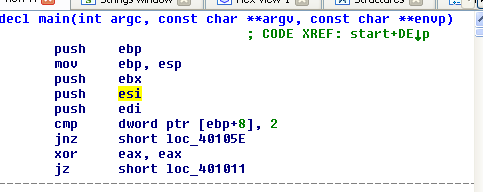
Ở hàm main này sẽ có 3 biến `agrc, agrv,envp` thì mỗi biến sẽ là 4 byte, sau đó đến biến tiếp theo sẽ có offset là `0Ch + 4` khả năng theo mình là biến cần truyền vào, chính là địa chỉ của `ecx`
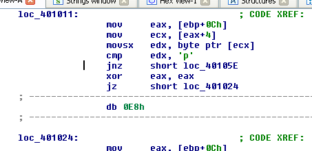
Đầu tiên nó nó so sánh kí tự đầu với `p`, nếu đúng thì cờ zero được bật thì sẽ không chạy được câu lệnh `jnz` để qua được để đến `good job`
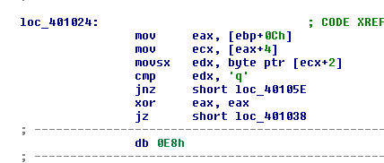
Tiếp đến kiểm tra phần tử thứ 3 == `q` không.
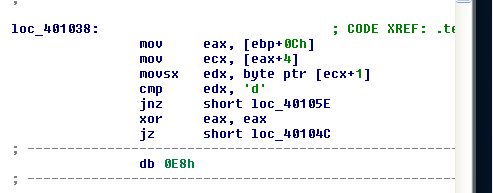
Tiếp đến kiểm tra phần tử thứ 2 == `d` không
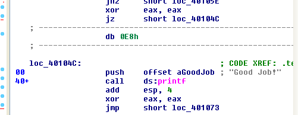
Nếu đạt đủ điều kiện thì sẽ in ra `good job`
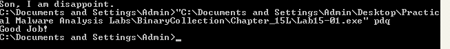
Chứng minh suy đoán là đúng

Ô đã hết rồi , cảm ơn mọi người đã đọc
