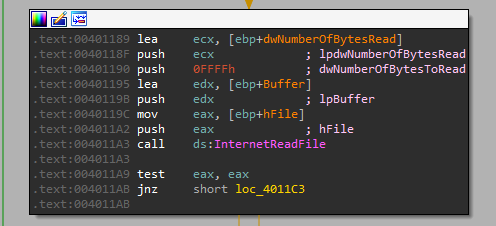

# Ques 1:What URL is initially requested by the program?
Bài này cũng giống như bài trước, ta thấy cũng là commandline-program

Nếu nhập sai sẽ hiện `not enough name”`

Nếu ở IDA và kéo xuống dưới ta sẽ thấy 1 chỗ đã bị dùng kĩ thuật antidisassembly

Ở đây ta thấy có opcode `E9` rất giống bài lab15_1 là `E8`

Ở đây ta thấy có lệnh `test esp esp`. Neus zero flag không được bật thì nó sẽ nhảy đến câu lệnh `call` đến địa chỉ không có thực. Điều này giống như lab trước đã đánh lừa IDA phân tích điều kiện sai trước.

Ta sẽ sửa như lab trước là undefine rồi reanalyze lại bỏ lại byte `E9` thì ta sẽ được như hình 

Tiếp tục phân tích kéo xuống dưới ta sẽ thấy 1 mẫu khác ở địa chỉ `004011D4` sẽ được nhảy đến nếu cờ zero được bật, ở trước câu lệnh nhảy sẽ có lệnh `xor eax, eax` lên cờ zero flag luôn được bật. 

Ta sửa lại lệnh bị đỏ như lần trước ta sẽ thấy có chỗ hay ở địa chỉ `00401215`.


Ta thấy nó nhảy đến địa chỉ +1 chính là địa chỉ của bản thân nó bao gồm, điều này là điều bất thường , hãy thử sửa lại

Tiếp tục đến địa chỉ `0040126D.`

Ở đây ta thấy 2 lệnh `jz và jnz` cùng nhảy đến cùng 1 vị trí. Đay là 1 kĩ thuạt anti-disassembly khác. Chúng ta hãy tiếp tục sửa , loại bỏ opcode byte `E8` để thấy được kết quả 

Tiếp tuc sửa ta sẽ được


Vì IDA của mình không có chức năng tạo function nên mình sẽ tham khảo đáp án và dùng chay.

Kéo xuống địa chỉ `40138C` ta sẽ thấy đây giống như 1 url

Ta sẽ được địa chỉ `‘http://www.practicalmalwareanalysis.com/bamboo.html’`

Đây có lẽ khai khai báo url bởi chương trình. Chúng ta có thể xác nhận bằng cách qua hàm reference của `sub_401386` 

ta sẽ thấy đây là tham số để gọi hàm `InternetOpenURLA`
# Ques 2: How is the User-Agent generated?
Để tìm được thông tin ta phải tìm được vị trí của nó trước khi gọi hàm ` InternetOpenA. `. Đến lúc này mình đã mở được function bằng ida ở máy thật =)). Sau khi tìm kiếm 1 lúc thì mình có thấy 1 phần gọi là `hostname`


Sau điều kiện `jnz` true thì ta thấy có 1 vòng lặp ở đây. Ở đây ta thấy `var_A20` giống như 1 biến đếm , so sánh xem đã đầy kí tự trong buffet khi đã khai báo từ trước chưa, mình sẽ đặt tên là `count`.


Biến `count` này đầu tiên được khai báo với giá trị bằng 0 trước khi thực hiện vòng lặp

Vòng lặp này sẽ làm 1 số thứ như sau:
- Đầu tiên kiểm tra xem vòng lặp quá 256 lần chưa bằng cách kiểm tra giá trị `count`, nếu đúng thì mở URL.
- Tiếp theo nó sẽ chạy 1 lần kiểm tra mình suy đoán rằng cái này kiểm tra tên đã nhập vào, nếu không nhập gì thì sẽ mở kết nối url, không thì sẽ  `jump đến loc_4010B5`.
- Tiếp theo nó sẽ kiểm tra từng ký tự của biên `name` bằng index `name + count` (0 tương đương ký tự 1, 1 tương đương kí tự 2) có bằng `90h(Z)` nếu có chuyển thành `A`
- Nếu != `Z` thì kiểm tra ==`7Ah(z)` không. Nếu có thì chuyển thành `61h(a)`
- Nếu != `z` thì kiểm tra == `39h(9)` không.Nếu có thì chuyển thành `30h(0)`
- Nếu != `9` thì giá trị hex = hex +1


Sau đó thì biến đếm  sẽ tăng lên 1 đơn vị

Kĩ thuật này chính là kĩ thuật xoay vòng , (rot1), kiểu như dịch đi 1 đơn vị của hostname. 

Dựa vào đây ta có thể kết luận  User-Agent chính là input được dịch đi 1 đơn vị 

Ví dụ : `abc012` -> `bcd123`

# Ques 3: What does the program look for in the page it initially requests?


Nếu chúng ta nhìn vào graph code sau khi gọi `call ds:InternetReadFile` thì ta thấy có hàm `strstr` tìm kiếm string `Bamboo::` có tồn tại trong buffer chứa nội dung lấy từ page trên url không. Đây chỉ là phần biến đổi và trích xuất đầu tiên

# Ques 4:What does the program do with the information it extracts from the page?

Sau khi đã tìm thấy `Bamboo::` thì chương trình tiếp tục tìm kiếm `::`, nếu thấy sẽ biến vị trí đầu tiên thành `0`. Từ đây ta có thể nói rằng chương trình muốn biến `Bamboo::` thành `Bamboo` bằng cách thêm dấu kết thúc câu ở vị trí `:` đầu tiên trong `::`

À mình biết tại sao tác giả lại patch byte `E8` thành nop `90` rồi reanalyze vì làm thế sẽ có thể hiển thị được ở chế độ graph view


Tiếp theo là hàm ` sub_40130F` là hàm tạo 1 chuỗi giống như là thông tin hoặc 1 file 

```asm
 call    sub_40130F
mov     [ebp+FileName], eax
```
Biến [ebp+FileName] được gán với giá trị `Account Summary.xls.exe`
Sau đó bạn sẽ thấy 

Nội dung của file exe sẽ được ghi nội dung bằng con trỏ của buffer sẽ chuyển sanh `str` sau đó sử dụng hàm `strstr` được con trỏ trỏ đến `dấu kết thúc dấu 0/` sau đó sẽ được + 8 byte có lẽ để dịch chuyển thêm 8 byte.

Khả năng là nhảy đến đâu đó trong buffer `str`


Sau khi ghi dữ liệu xong thì malware không hoạt động gì tiếp cả. Nếu chung ta kiểm tra cẩn  thận thì sẽ thấy hoạt động disassembly là không thể nữa trong suốt thời gian phân tích. 

Chúng ta có thể kết luận rằng malware này chạy để ghi vào 1 file exe vào đĩa. CHúng ta có thể đây là loại malware downloader và luancher tạo ra để drop file với 2 extension `.xls.exe` và sẽ thực thi nó 

Cảm ơn mọi người đã lắng nghe
