# Ques 1: How is the malicious code initially called?
Sử dụng Fakenet-NG để giả lập card mạng, khi ta bấm chạy malware thì nó sẽ hiện lên 1 terminal hiện danh sách tiến trình xong 1 lúc thì sẽ tự tắt và sẽ có kết nối
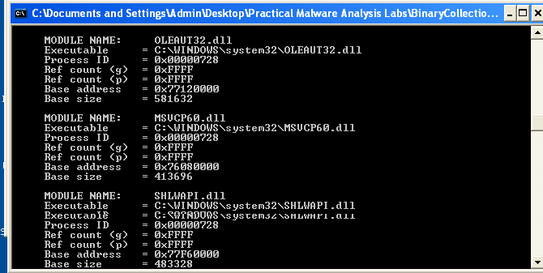
Ở màn hình Fakenet thì ta thấy có 1 gói tin HTTP gửi từ malawre đếm C2 server
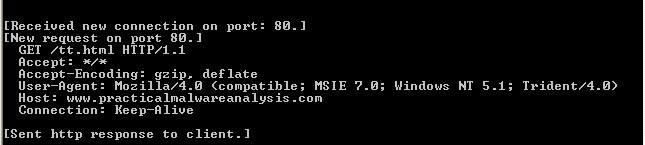

Mở malware bằng IDA để phân tích 
Mở cửa sổ View chọn Imports ta thấy có 1 bằng chứng về `URLDownloadToFileA`
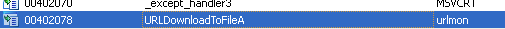
Khi mình reference chức năng này rồi tìm thấy chỗ gọi rồi mình muốn chuyển từ code thành paragrahp không được bằng dấu `space`
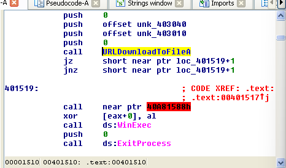
Mình nghĩ ngay chương trình này đã sử dụng 1 kĩ thuật gì đó , có thể biến đổi code ,...

Đầu tiên ta kiểm tra ta thấy có phần khá lạ
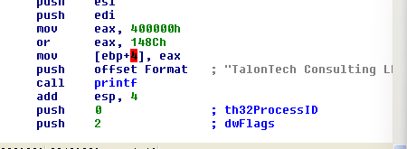
Sau khi biến đổi eax thì sẽ truyền giá trị eax vào `[ebp+4]` là giá trị trả `return address`
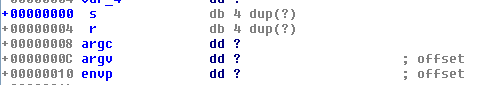
Từ đây ta có thể suy luận ra return address sẽ nhảy về địa chỉ `0x0040148C`. Hãy phân tích địa chỉ ở `0x0040148C` để xem cơ chế anti-disassembly. Dùng `G` để jump đến địa chỉ 
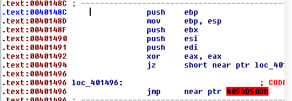
Bằng bôi đen các dòng code ở section bị đỏ , sau đó chuột phải rồi chọn `Analyze selected area  C` thì ta thấy code đã bị biến đổi, ta sẽ bỏ 1 byte `0E9h` rồi bôi đen + reanalyze lại
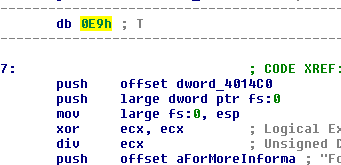

Tiếp theo bạn sẽ để í có lệnh chia cho 0 
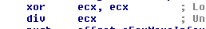
Lệnh này sẽ gây lỗi và lệnh hiển thị text ở sau lệnh đó sẽ không bao giờ được hiển thị dẫn đến đây là phần không thể tự động phân tích được của IDA. 
Kết luận của câu này là code ban đầu mà sẽ được gọi  bằng cách ghi đè địa chỉ trả về ở stack đi đến 1 tiến trình khác sau khi  chương trình chính chạy xong.

# Ques 2:What does the malicious code do?

Tiếp tục với vị trí ở câu trước, ta có thể thấy 1 reference của     `004014C0` được gọi từ `loc_401497`, không phải 1 lệnh `call` mà là 1 lệnh `push`. 
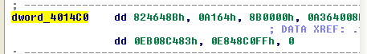
Điều này cho ta giả định rằng lỗi chia cho 0 đươc xử lý bởi 1 trình xử lí ở đây nhưng IDA hiểu rằng đây là dữ liệu

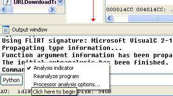
Ở `AU` hãy nhận chuột phải rồi chọn `Reanalyze Program` , sau đấy ta được như ảnh dưới
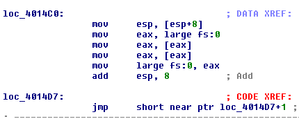
Sau đó ta lại thấy 1  anti-disassembly tại ` 004014D7`
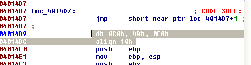

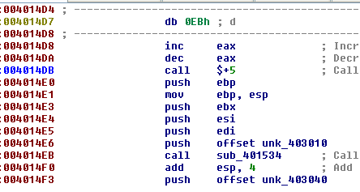
Bằng cách bỏ qua byte `EB` sau đó chuyển lại thành code.

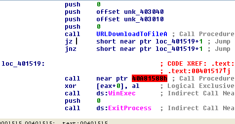
Nhìn qua ta có thể thấy 1 lệnh call đến `URLDownloadToFileA` và rồi lại 1 cơ chế anti-disassembly rồi tiếp đến là  1 lệnh call đến `ds:WinExec`

Tiếp tục undefinded rồi  bỏ 1 byte rồi reanalyze ta được như ảnh sau:
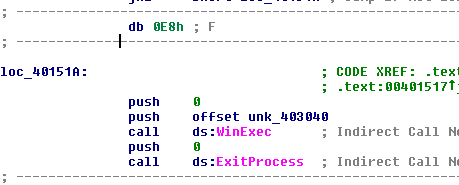

Ở đây ta có thể kết luận rằng khá chắc rằng malware sẽ tải file từ url rồi thực thi nó.

# Ques 3:What URL does the malware use?
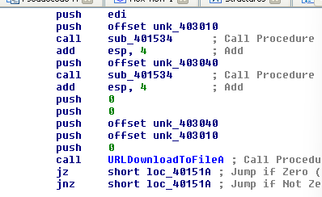
ở đây ta thấy có các tham cố của `URLDownloadToFileA` như sau
    HRESULT URLDownloadToFileA(
    LPUNKNOWN            pCaller,
    LPCSTR               szURL,
    LPCSTR               szFileName,
    DWORD                dwReserved,
    LPBINDSTATUSCALLBACK lpfnCB
);
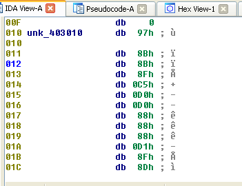
thì ta thấy `offset unk_403010` chính là URl độc hại, trước đó đã bị biến đổi thông qua hàm  `call    sub_401534`, 
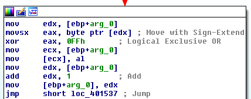
khi ta xem hàm thì thấy đây là cơ chế đảo bit của từng byte, dừng khi gặp kết thúc chuỗi `\0`

Sau đó sẽ sẽ dùng 1 code python để decript đơn giản đã đính kèm ở trong lab, kết quả ta thu được là
`http://www.practicalmalwareanalysis.com/tt.html`
# Ques 4: What filename does the malware use?
vì `URL và filename` đều dùng chung 1 phương thức nên ta có thể lấy được tên file là `spoolsrv.exe`

Ở sao ngắn vậy nhỉ , ko quen =)))) 
Thôi, cảm ơn mọi người đã xem.!!!