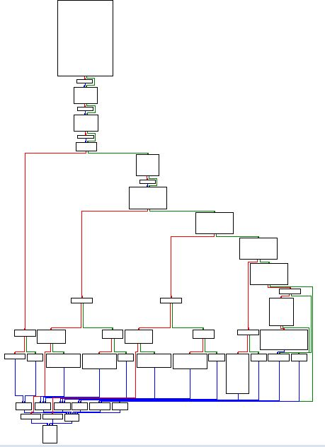

[https://www.jaiminton.com/Tutorials/PracticalMalwareAnalysis/Chapter16/#](https://www.jaiminton.com/Tutorials/PracticalMalwareAnalysis/Chapter16/#)
bạn nên đọc phần lý thuyết này trước khi vào làm bài.
# Ques 1:Which anti-debugging techniques does this malware employ?
Bắt đầu mở malware bằng IDA, thì ta thấy ở phần Graph overview thì ta thấy có rất nhiều lệnh nhảy có điều kiện

Ngay ở hàm main ta thấy ngay có lệnh `mov     eax, large fs:30h` là 1 anti debug , sau đó tiếp theo ta sẽ thấy lệnh `test    eax, eax` để so sánh `eax` có bằng 0 không. Nếu EAX != 0 thì sẽ gọi hàm `‘sub_401000’ `.

Nếu ta nhìn vào hàm ` sub_401000` thì chúng ta sẽ thấy mục đích của hàm này là xóa file chính bản thân nó vì có hàm     `GetModuleFileNameA(0, &Filename, 0x104u); với tham số đầu tiên là 0`và output sẽ vào NULL. Tổng hợp từ đầu cho ta thấy malware này sử dụng các kĩ thuật anti buggging và nếu phát hiện ra là đang bị debug thì sẽ xóa chính bản thân nó

Tiếp tục điều tra ở hàm main ta thấy malware sử dụng rất nhiều reference đến `“fs:[30h]” (The Process Execution Block) ` của tiến trình đang chạy, nhìn xuống phía dưới ta có thể thấy các kỹ thuật so sánh các byte , cờ có được set không của ` ‘BeingDebugged’, ‘ProcessHeap’ or ‘NTGlobalFlag’ `

Chúng ta có thể chắc chắn rằng 1 số thành phần trong document của PEB structures không được công khai.???

# Ques 2: What happens when each anti-debugging technique succeeds?
Như đã nói ở trên nếu bất kì điểm nào của kỹ thuật anti debugging mà thành công thì nó sẽ chạy hàm `sub_401000` để tự xóa chính mình và hủy chương trình.

# Ques 3:How can you get around these anti-debugging techniques?
Sẽ có nhiều cách để di vòng qua được các kỹ thuật này như dùng plugin hoặc thủ công patch byte. Ở lần này mình sẽ dùng plugin `scyllahide`

Hướng dẫn qua thì tải tại đây [Ollydbg v2.0.1](https://www.ollydbg.de/version2.html) và tải ở đây [Skyllahide](https://github.com/x64dbg/ScyllaHide/releases) sau đó giải nén và trong thư mục chính của Skyllahide thì   có thư mục tên  là `Olly 2`, hãy sao chép 3 file ở đây rồi paste vào thư mục của Ollydbgv2 như ảnh sau khi đã paste

Sau đó ta sẽ vào Ollydbg rồi vào ` Plugins > ScyllaHide > Options` để cài đặt để ẩn các thành phần dùng để anti debug từ PEB

# Ques 4:How do you manually change the structures checked during runtime?
Để làm thủ công chỉnh PEB structure checked trong runtime , chúng ta sẽ debug program thông qua Ollydbg (vì có commandline plugin)

Sau đó dùng command line để dump giá trị của 1 trường ở PEB ra `dump fs:[30] + 2` sau đó sẽ chình patch byte từ giá trị `01` thành `00`. Theo mình được biết tìm hiểu thì như bạn nhìn ở IDA thì có rất nhiều hàm gọi để kiểm tra xem flag ở `fs:[30] + 2` có được bật không nhưng `dump fs:[30] + 2` chỉ hiện 1 giá trị duy nhất vì các lệnh kia chỉ tham chiếu, đọc giá trị ở 1 ô nhớ.

Sau khi patch thì ta chỉnh sửa thủ công được PEB struture để tắt cờ ` ‘BeingDebugged`

Tiếp theo ta sẽ đến với `ProcessHeap:`
Cũng như cách ở trên , ta sẽ tìm 4 byte là số flags của ProcessHeap,, chúng ta sẽ check ở offset 0x10 (Ở win xp): `dump ds:[fs:[30] + 0x18] + 0x10`, chúng ta tiếp tục điền tất cả bằng 0.
Ở đây khá lạ là cả 2 phần chỉnh của mình đều khác so với hướng dẫn. Ảnh đầu là của mình , ảnh 2 là của wu

Ở đây , mình đã thành công sửa ` ProcessHeap` để ngăn chặn việc check `‘ForceFlags’`

Tiếp theo chúng ta sẽ patch PEB ở offset 0x68 để kiểm tra `NTGlobalFlag == 0x70`

Đến đây mình đã thành công trong việc sửa đổi trong suốt runtime, Sau đó đẻ lưu file ta sẽ `chuột phải  -> copy to execute -> chuột phải -> save file -> yes.`

Nếu ta làm thủ công thì sẽ mất rất nhiều thời gian vì nếu tìm các cross-reference đến hàm `sub_401000` thì sẽ tìm thấy tận 79 mục cần phải vá 

# Ques 5: Which OllyDbg plug-in will protect you from the anti-debugging techniques used by this malware?
Cái này thì tác giả wu giới thiệu rất kĩ nhưng mình chỉ dùng scyllahide
Nguyên văn
`As explored previously there are a number of anti-debugging plugins available in addition to a PyCommand that can be used through Immunity Debugger including HideDebug and ScyllaHide.`

Tổng kết lab này mình thấy chỉ học được cách nhảy qua các anti-debug, chắc mục đích chính của nó là vậy chứ không phân tích kĩ malware. Đến đây là hết rồi. Thanks for reading!.