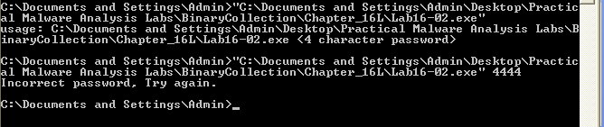

# Ques 1:What happens when you run Lab16-02.exe from the command line?
Oke mình sẽ cho malware vào command line thì mình thấy nó hiện ra kết quả kiểu như yêu cầu password gồm 4 kí tự. Sau đó mình nhập lại và thêm 4 ký tự bất kỳ thì nó hiện sai và thử lại. Mình nghĩ đây là 1 bài key gen. 


# Ques 2:What happens when you run Lab16-02.exe and guess the command-line parameter?
Sai mật khẩu xin nhập lại

# Ques 3:What is the command-line password?
Để bắt đầu, ta sẽ mở bằng IDA thì ta sẽ thấy ngay có 1 hàm string compare ở đây, vào graph view để nhìn cho dễ, cái thứ 2 là code được chứa ở .tls section là điều không bình thường chút nào , từ đây ta có thể khẳng định malware đã sử dụng kĩ thuật anti-debugging


Vì string nhập vào sẽ so sanh 4 byte với ` &byte_408030` thì ta sẽ truy cập vào đó để xem có gì, thì nhìn vào 4 byte ta thấy 2 byte đầu là bình thường nhưng 2 byte sau đều là `0xFF` dường như liên qua đến các thanh ghi memory??? Chúng ta nên phân tích sâu hơn

# Ques 4: Load Lab16-02.exe into IDA Pro. Where in the main function is strncmp found?
Lạ nhỉ , tự nhiên có câu hỏi này được, thôi thì cứ trả lời 
Nhìn vào IDA ta thấy hàm `strncmp’` được nằm ở địa chỉ ` 0x40123A.`
# Ques 5:What happens when you load this malware into OllyDbg using the default settings?
Khi cho vào Ollydbg v1 và v2 thì thấy không hit được vào các breakpoint và lập tức hủy chương trình.
# Ques 6: What is unique about the PE structure of Lab16-02.exe?
Để phân tích thêm ta sẽ cho malware vào PE-bear. PE-bear cho chúng ta biết 1 .tls callback xuất hiện sẽ chạy trước chương trình chính, muốn nhìn kĩ thì nhìn vào IDA bắt đầu từ địa chỉ `.tls:00401000` rồi kéo xuống bạn sẽ thấy rõ 


Sau đó ta để ý thêm malware sẽ sử dụng sử dụng các kĩ thuật anti debug khác như gọi API `‘OutputDebugStringA`, hoặc tìm cửa sổ window nào có tên là `OLLYDBG`

# Ques 7:Where is the callback located? (Hint: Use CTRL-E in IDA Pro.)
Ở PE bear ta có thể thấy được địa chỉ của callback bằng cách chọn tab TLS


Hoặc ở IDA dùng `Crtl + E` 


Từ đây ta biết địa chỉ hàm callback là `0x401060.`

# Ques 8: Which anti-debugging technique is the program using to terminate immediately in the debugger and how can you avoid this check?
Phân tích tls callback ở IDA thì ta nói lại đến hàm tìm cửa sổ window nào có tên là `OLLYDBG`


Nếu không có cửa sổ tên `OLLYDBG` thì sẽ tiếp tục chạy, nếu có thì sẽ hủy chương trình

Giải pháp là chạy trình debugger khác, đổi tên cửa sổ khi chạy trên bộ nhớ bằng 1 plugin, hoặc đơn giản hơn là patch by chỉnh từ `jnz` sang `jz`, hoặc có thể thay đổi byte thành byte `0x90 (NOP)`

Using Another Debugger: Sử dụng 1 Debugger khác như `Using Another Debugger:`

Modify Window Class Name: Dùng plugin như `ScyllaHide ` để thay đổi tên cửa sổ . Hoặc không cần làm thế thì ta có thể hook `NTUserFindWindowEX` sẽ được gọi bởi `NTUserFindWindowA ` cái mà sẽ vô hiệu hóa API đang được gọi 


Chúng ta phải chuyển chỗ start sang TLS callback để patch


Modify Program: Ta có thể biến đổi thành NOP để không cần thực hiện nữa , ví dụ ở đây debugger sẽ ưu tiên luồng false đầu tiên và sẽ gọi hàm `exit` thì ta sẽ thay bằng NOP =)) để tiếp tục chạy. Đoạn này hài vãi mình cũng không ngờ thay vì patch lệnh `jz` 


# Ques 9:What is the command-line password you see in the debugger after you disable the anti-debugging technique?
Cái này sau khi mình mò mẫm mãi vì không làm đúng theo hướng dẫn thì mình nhớ ra 1 điều là hướng dẫn đã thiếu, đó là phải đổi giá trị thanh ghi `eax = 0` trước khi chạy lệnh `test eax, eax` đã sửa đổi hay nhảy qua được flow mong muốn vì theo thực thế muốn vào flow đấy thì `FindwindowA` sẽ không tìm thấy cửa sổ nào tên `ollydbg` cả !!! 

Tiếp nhé vẫn còn phải bổ sung thêm là đến đoạn so sánh 


Thì lúc đó `argc =1` thì lúc đó sẽ in ra `"usage: %s <4 character password>\n"` rồi đóng chương trình vì chúng ta không đưa vào password nên sẽ không đến được địa chỉ `0x40123A (string compare operation) ` mà ta mong muốn để xem password nhập vào so sánh với password mẫu bị biến đổi như thế nào. Vì thế khi có lệnh 


Sau đó cờ `Zero flag = 1` thì ta sẽ chỉnh thành bằng 0 sau đó chạy tiếp đến breakpoint đã đặt ở `0x40123A`. Thì chúng ta kiểm tra lại mật khẩu mẫu đã trở thành `bzrrp@ss` nhưng chúng ta chỉ check 4 byte đầu 


Sau đó ta sẽ kiểm tra lại xem có đùng mật khẩu là `bzrr` không. Khá lạ khi đã tắt ollydbg rồi , nhưng khi chạy ở cmd lại không được. Nhưng khi debug biến đổi ở ollydbg thì lại được ?????


# Ques 10:Does the password found in the debugger work on the command line?
Theo mình thấy với phiên bản của mình làm thì nhập password rồi nhưng nó hiện vẫn incorrect. Khả năng chỉ đúng khi malware không quan tâm đến có chạy ở debugger hay ko ??? Tiếp tục tìm những phần trước khi gọi hàm string compare thì ta thấy 


Ta sẽ truy cập và phân tích `StartAddress` vì là 1 tham số để tạo nên 1 thread, thì xem qua thì thấy đây là 1 hàm biến đổi 4 byte mẫu từ đầu.


Nhìn qua thì ta sẽ thấy có anti debug tìm giá trị cờ `BeingDebugged’` của PEB tạ offset +2  và ở tls section.


Vì ở lần trước ta đã dùng ScyllaHide có 1 số options chống kĩ thuật anti-debug setting, trong đó có bao gồm loại bỏ cờ `‘BeingDebugged’` được bật. Sau đó chúng ta sẽ disable option này và chạy lại sẽ thấy output password khác.


Ở đây 4 byte đầu ta thấy đã khác đó là `bzqr` =))). Chúng ta sẽ thử lại mật khẩu. Với phiên bản của mình thì nó vẫn không được , lạ nhỉ =))


Thật ra dưới đây mình sẽ phân tích tại sao lại không được, phân tích này là ý của mình và kết quả cũng sẽ giống câu 11 của tác giả 

Mình nhìn nhanh phần mã hóa kia thì mình thấy chủ yếu sẽ tập trung vào 4 byte đã biết giá trị sẵn là `byte_408030 byte_408031 byte_408032 byte_408033` sẽ biến đổi theo các công thức, còn kết quả sẽ phụ thuộc và 2 giá trị đó là `byte_40A968; có thể bằng = 0 hoặc 1 *(_BYTE *)(__readfsdword(0x30) + 2); có thể bằng 0 hoặc 1` 

Vì khi mình nhìn reference của byte_40A968 mình thấy như ảnh 


Còn fs[0x30] +2 kia là flag `‘BeingDebugged’` 

Nên sẽ có 4 kết quả là 
```
byte_40A968=0, v13=0 -> 62 79 72 72 => 'b' 'y' 'r' 'r'

byte_40A968=0, v13=1 -> 62 79 71 72 => 'b' 'y' 'q' 'r'

byte_40A968=1, v13=0 -> 62 7A 72 72 => 'b' 'z' 'r' 'r'

byte_40A968=1, v13=1 -> 62 7A 71 72 => 'b' 'z' 'q' 'r'
```

Sau đó mình thử thì thấy cái đầu tiên là cái đúng


# Ques 11:Which anti-debugging techniques account for the different passwords in the debugger and on the command line, and how can you protect against them?
Trở lại câu 6 thì ta đã tìm thấy 1 reference trong `OutputDebugStringA’` trong tls. Sau đó ta sẽ hook và thử debug lại


Chúng ta sẽ tìm reference (bấm phím X) của `byte_40A968’` thì thấy có 2 phần up (trước khi diễn ra hoạt động này ) ở `sub_401020 `


Ở đây ta thấy họ có gọi ` OutputDebugStringA` với tham số là `b` và 1 error code là `0x3039`. Nếu hiện diện lỗi code thì chứng tỏ đang chạy ở trong debugger và sẽ set byte_40A968 to 1.


Sau đó sẽ sẽ được add vào biến trong hàm biến đổi đã giải thích đươc tại sao kết quả cách nhau 1 ký từ (bzqr thay vì bzrr)


Kĩ thuật này với việc gọi các API là không ổn định và việc password được dựa vào đây sẽ cho ra các kết quả khác nhau dựa vào phiên bản hệ điều hành ví dụ như win 7 và win xp

Sau đó tác giả sẽ NOP phần ảnh hưởng của `‘OutputDebugStringA’ ` đi để cho ra kết quả của 32 bit


Sau đó tác giả sẽ giải thích thêm về việc ảnh hưởng của hệ điều hành tới kết quả của hàm gọi API `OutputDebugStringA’`

Kết luận là password ở win 7 không dùng debugger là `bzrr` còn wiwxp là `byrr`

Đến đây là kết thúc rồi.

Qua bài này mình đã học được các kĩ thuật anti debug malware có thể dùng vào việc ảnh hưởng đến code chạy chứ không đơn thuần là kiểm tra có debug hay không , vì vậy cần phải xem reference cho kỹ. Tiếp theo là có rất nhiều kỹ thuật anti-debug đã được dùng đến. Có thể dùng plugin hoặc patch thủ công. 

thanks for reading.