# Ques 1: Which strings do you see when using static analysis on the binary?
Mở pestudio chúng ta có thể thấy 1 số strings liên quan đến cmd.exe đang cố gắng xóa thứ gì đó, strings associated với cố gắng truy cập acces to current window mà nó đang chạy bên trong, và có liên kết với `gettickCount` được sử dụng làm anti-debug.
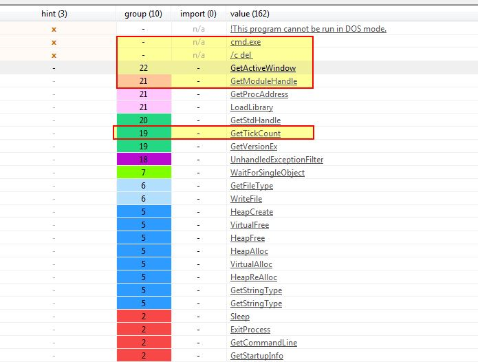

Tiếp tục nhìn vào bảng imports ta sẽ thấy nhiều APIs hơn liên quan đến kết nối mạng hơn, và có nhiều kĩ thuật anti-debug hơn
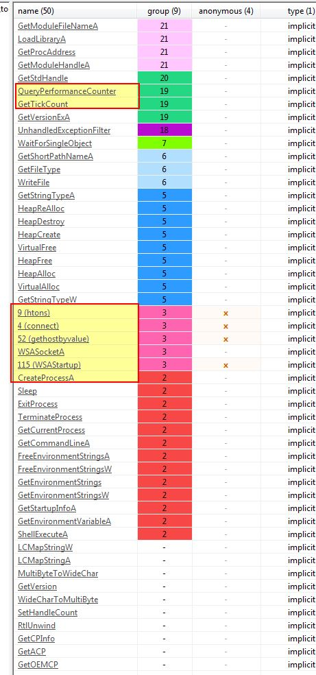

# Ques 2:What happens when you run this binary?
Nếu ta chạy malware thì nó đơn giản là tự hủy và không có hành động nào cả , nhìn đơn giản là vậy, hãy tiếp tục phân tích.
#  Ques 3 : How must you rename the sample in order for it to run properly?
Nếu ta nhìn vào hàm main thì ta thấy có 1 string khả nghi được push vào stack `ocl.exe`
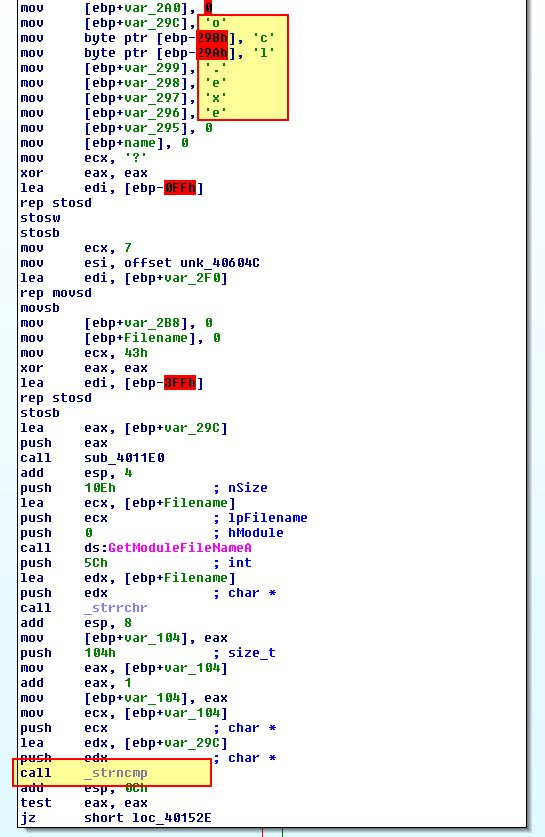

Tác giả có nói đến đây là bản copy của lab 9-02 và thêm vào 1 số kĩ thuật  anti -debug. Nếu mình rename thành `ocl.exe` và cố gắng chạy thì sẽ không có gì xảy ra. Vì vậy mình xem kiểm tra hoạt động trước khi hàm `strncmp` được gọi để xem có phần biến đổi nào đến `ocl.exe` không trước khi kiểm tra tên. 1 cách dễ là dùng debugger đạt breakpoint tại hàm `strncmp(0x401518)`. Nhưng khi chạy thì chúng ta sẽ thấy lỗi chia cho 0

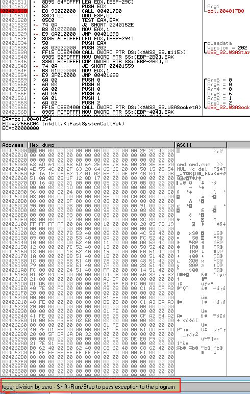
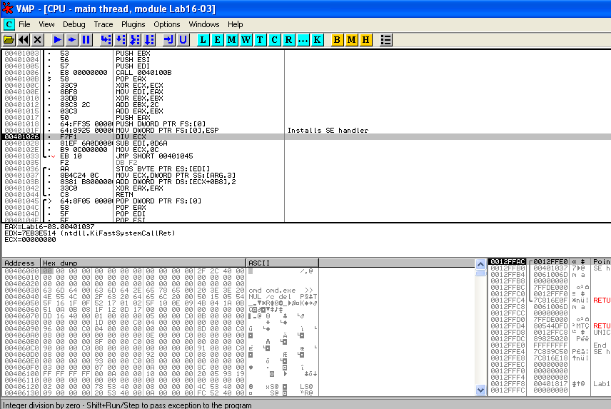

Với phiên bản của mình thì khi mở malware bằng ollydbg2 thì phải set lại điểm chạy bằng cách đến địa chỉ `0x4013D0`, rồi chuột phải, chọn `set new origin`, sau đó làm như hướng dẫn. Sau đó ta sẽ bypass bằng ` SHIFT + F9` rồi cho chạy tiếp đến breakpoint  `strncmp(0x401518)` thì sẽ được kết quả đang so sánh với chuỗi `qgr.exe`.

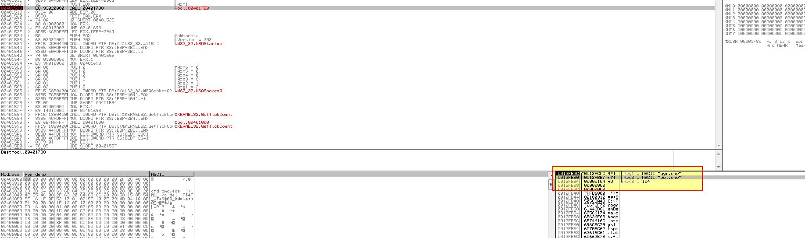

Nếu chúng ta rename chương trình malware lab 16-02 này và tiếp  tục chạy debug thì sẽ chạy đến 1 lỗi chia cho 0 khác, và chúng ta không thể đi vòng qua nó được. Nếu dùng Fake-ng thì sẽ không bắt được bất cứ gói tin nào.

Tiếp tục phân tích hàm `sub_4011E0` được truyền vào tham số `‘[ebp+var_29C]’ (ocl.exe).` khi xem debug.

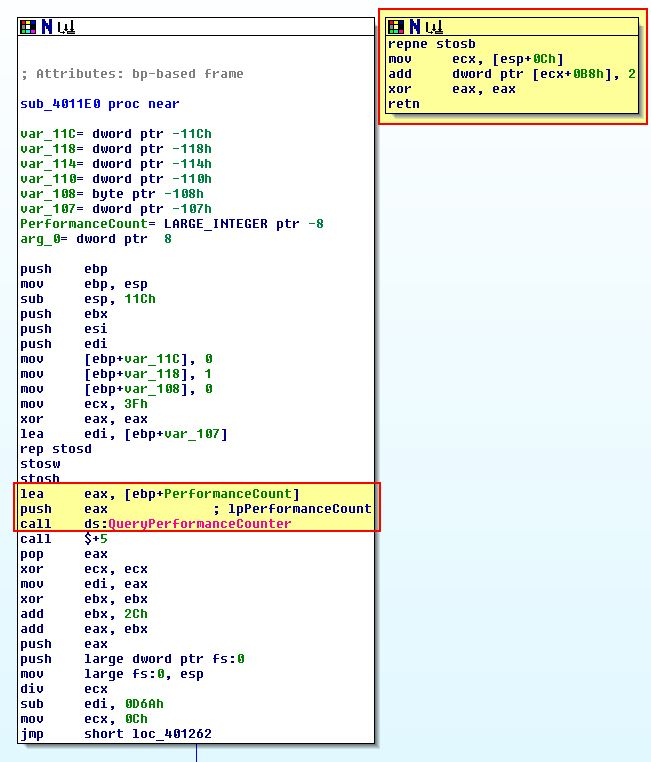

Ở đây ta thấy rõ là đoạn code này không thực sư bình thường khi nó gọi đến bất cứ đâu mà không có cross-reference. Điều này cho ta thấy chỉ khi có điều kiện bất thường mới chạy được code này, và khi ta so sánh với lệnh gọi đến `‘QueryPerformanceCounter’` có lẽ là 1 kỹ thuật timming anti-debug

Đầu tiên phần mềm lấy giá trị ` ‘[ebp+PerformanceCount]’ ` chứ output đầu của `‘QueryPerformanceCounter’` sau đó lại gọi lại 1 lần nữa và lưu giá trị vào `‘[ebp+var_110]’.` Bây giờ ta có 2 giá trị thời gian, và sau đó trừ cho nhau để xem khoảng thời gian có không quá 1200 không. Sau đó sẽ có lệnh nhảy có điều kiện. Và chú ý đến có lệnh chia cho 0 ở đây 

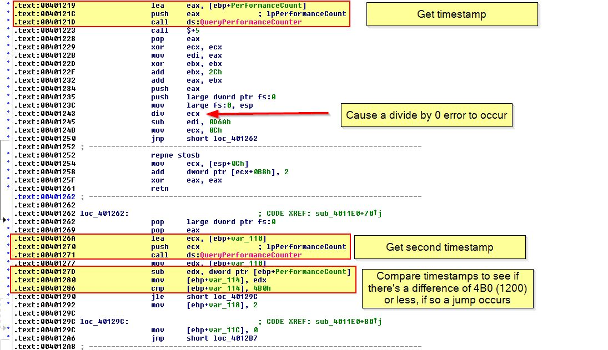

Nếu ta nhìn xuống phần còn lại của hàm thì thấy nếu điều kiện nhảy thành công (vượt qua được kiểm tra debug ) thì biến ` var_118 ` giữ nguyên và sau đó có 1 chuỗi code biến đổi hoặc giải mã. Còn ngược lại  `var_118` sẽ thay đổi thành 2 và sau đó cũng chạy code biến đổi và sẽ thay đổi kết quả, giống như việc thay đổi tên chương trình mẫu để check vậy. 

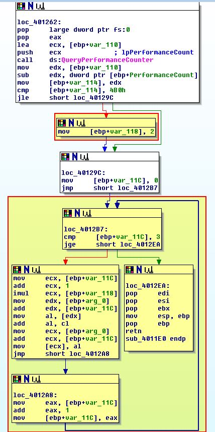

Để bảo đảm việc vượt qua hàm check này , chúng ta có thể dùng NOP ở `‘0x401292’ ` chứu đoạn chuyển `var_118 to a ‘2’,` hoặc đơn giản hơn là chuyền `JLE(7E) -> JG(7F)`.Ở đây mình dùng cách 2 . Ở đoạn này nhớ vượt qua 1 lỗi chia cho 0 bằng cách `Shift + F9`.

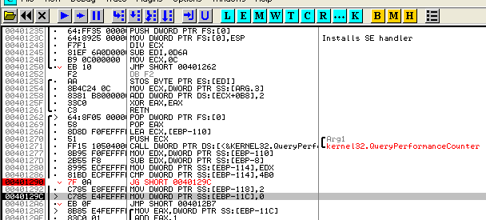

Sau đó ta sẽ tiếp tục chạy và vượt qua các lỗi thì ta sẽ thấy hàm so sánh với string mới là `peo.exe`

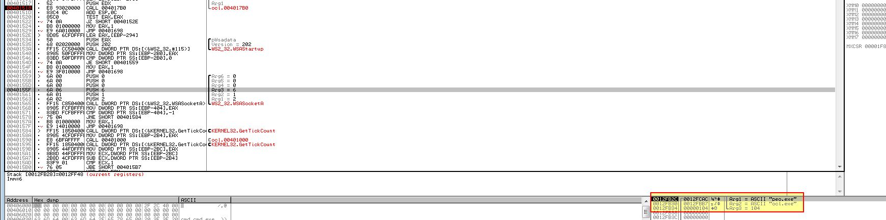

Thay đổi tên lab thành `peo.exe` rồi bật Fakenet-ng thì mình chỉ thấy request như ảnh này chứ không giống được như của tác giả
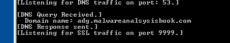

# Ques 4:Which anti-debugging techniques does this malware employ?
Như ở trên ta đã thấy malware đã sử dụng ` ‘QueryPerformanceCounter’ API`, để tìm kiếm thêm còn kĩ thuật nào khác không, ta sẽ quay lại hàm main

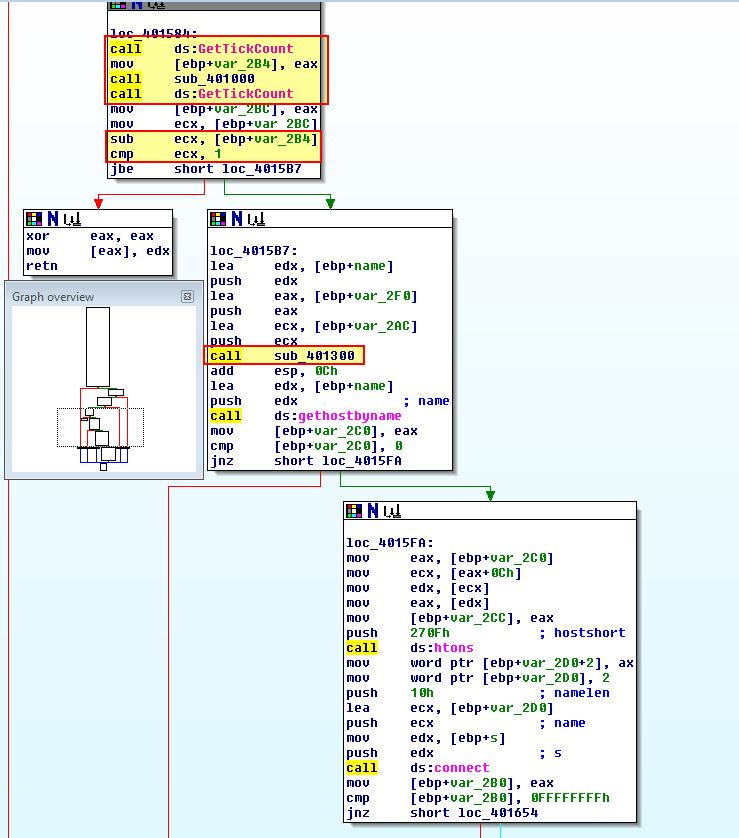

Ở đây chúng ta thấy có lệnh call với 2 hàm `‘sub_401000’` và `‘sub_401300’` trước khi gọi các API tìm kiếm domain và tạo connection, không tự nhiên 2 hàm xuất hiện ở đây , có thể đoán rằng đây là 2 hàm anti-debug. Vì vậy chúng ta sẽ phân tích hàm `‘sub_401300’` đầu tiên, vì hàm này được vây quanh bởi 1 API đáng ngờ là `‘GetTickCount’` có vẻ như lại là 1 hàm check time khác

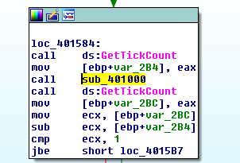
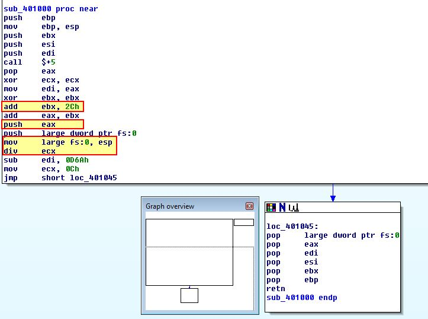

Chúng ta có thể thấy rằng chương trình thực hiện chia cho 0 giống như các lần trước. Tuy nhiên, chúng ta sẽ không xem xét kĩ làm thế nào cả 2 hàm check sử dụng eip lần  đầu tiên với offset là `0x2C` trỏ đến code khác để chạy. Nó sẽ push cái này như là 1 ví trí cho 1 SEH sẽ được gọi khi chia cho 0. Thật ra chỗ này mình chưa hiểu nếu chạy malware mà không debug thì malware có chạy đến đây và gây ra lỗi không.

Cả 2 hà này được thiết kế để gây lên ngoại lệ sẽ làm cản trở việc debugging, và cũng sẽ gây ra đầu ra khác từ malware. Sau khi gọi 2 API `GetTickCount’` thì sẽ so sánh khoảng 2 mốc thời gian == 1(mili giây)  , sau đí sẽ có lệnh truyền `edx` vào trong địa chỉ trỏ đến `0`, điều này dẫn đến lỗi ngoại lệ vi phạm quyền truy cập sẽ làm chương trình crash, wow !!!

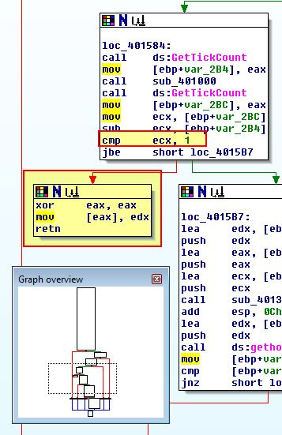

Tiếp tục phân tích hàm `‘sub_401300` , chúng ta sẽ thấy 1 hàm so sanh giống câu 3 (mình không nhớ là có =))) , thay vì dùng hàm như các API trên thì ở đây sử dụng `‘rdtsc’` để lấy 2 mốc thời gian rồi sau đó trừ cho nhau để lấy khoảng thời gian so sánh với `500000`, nếu vướt quá thì sẽ gọi hàm `sub_4010E0`

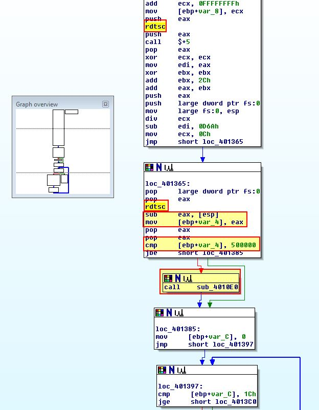

Sau đó phân tích hàm `sub_4010E0`, thì mình đã thấy hàm này từ trước rồi, mục đích của hàm là tự hủy chính bản thân nếu hàm check ở trên fail.

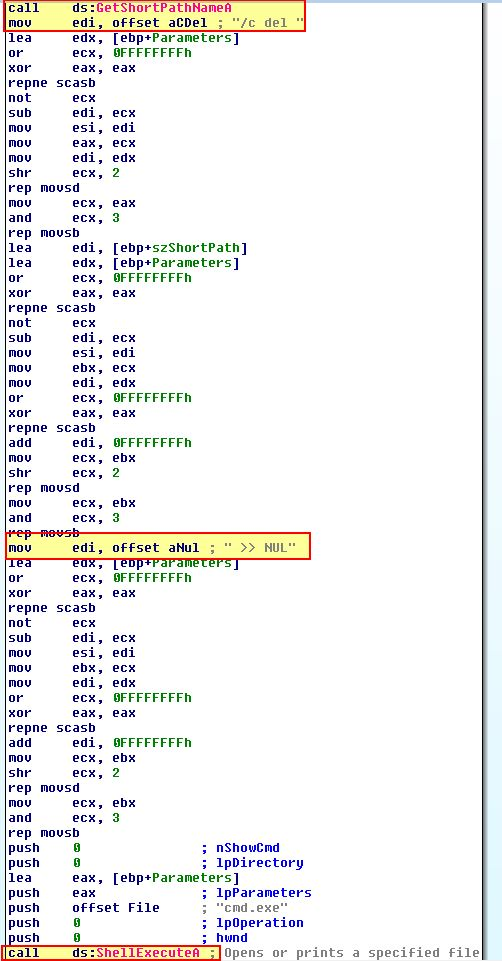

# Ques 5: For each technique, what does the malware do if it determines it is running in a debugger?
## QueryPerformanceCounter:
Ở câu hỏi số 3 thì malware sẽ thay đổi giá trị thành `2` trong phép tính giải mã để check tên chương trình , sẽ kích hoạt nếu đang chạy ở debugger. Dùng API `QueryPerformanceCounter’` để check
## GetTickCount:
Ở câu 4 , ta có thể thấy ta có thể thấy nếu phát hiện debugger sẽ gây ra lỗi ngoại lệ như chia cho 0, đưa giá trị vào địa chỉ 0 sẽ làm crash chương trình. Dựa vào API `‘GetTickCount’ ` để check khoảng thời gian
## rdtsc:
Ở câu 4, chúng ta biết rằng malware sẽ tự xóa bản thân mình nếu phát hiện debugger dựa vào lệnh `rdtsc` để check khoảng thời gian

# Ques 6: Why are the anti-debugging techniques successful in this malware?
Các kĩ thuật anti-debug được sử dụng thành công vì có nhiều kĩ thuật được sử dụng và dựa vào khoảng thời gian chênh lệch được sử dụng nếu không có khả năng xử lí lỗi dựa vào SEH. Khoảng thời gian này trở nên rõ ràng khi debugger ngăn chặn lỗi chia cho 0. Trong khi nếu malware chạy ngoài debugger thì độ trễ sẽ không xuất hiện.

À mình hiểu chỗ này, ví dụ ở debugger khi chạy đến chỗ chia 0 thì sẽ dừng ở đấy , sau đó sẽ `Shift +F9` là chạy bình thường được do SEH bây giờ mới được chạy đến 

# Ques 7:What domain name does this malware use?
Khác với tác giả , mình chỉ cần dùng Fakenet-ng là ra
doamin là `adg.malwareanalysisbook.com`

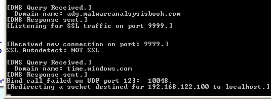

--- 
Sau bài này mình học được nhiều thứ , như đưa giá trị vào địa chỉ 0, chia cho 0, check timestamp.

Cảm ơn vì đã đọc !