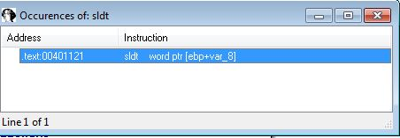
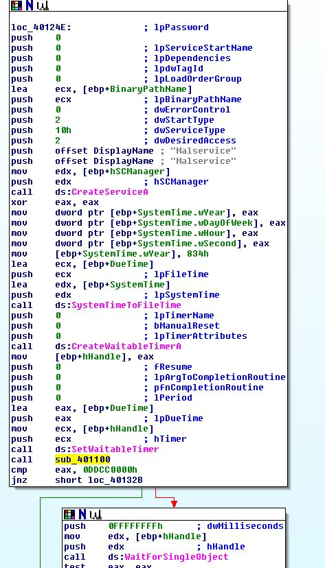

# Ques 1: What Anti-VM techniques does this malware use?
Ở đây ta sẽ thấy 1 file tên nghe khá hay `findAntiVM.py` , sau đó ta sẽ chọn mở bằng notepad hoặc các công cụ khác để xem nội dung của nó 

Nhìn vào thì ta thấy code kiểm tra xem có tồn tại thành phần mnemonic không :`sidt, sgdt ,sldt ,smsw ,str ,in ,cpuid`

Sau đó để chạy file ta sẽ vào IDA, chọn `File -> Script` sau đó chon file IDApython trên , sau đó ta sẽ được kết quả 

Code trên có nhược điểm là chỉ có cho địa chỉ chúng ta phải jump vào địa chỉ đó mới biết được câu lệnh của nó là gì  hoặc chúng ta có thể dùng cách thủ công là tìm kiếm text lần lượt `Alt +T` , sau đó chọn option `Find all ocurrences`, sau khi tìm kiếm sẽ thấy 3 kết quả 

SIDT:

STR:

SLDT:

Từ đây mình có thể kết luận là đang sử dụng điểm yếu của cấu trúc lệnh x86 để phát hiện vmware

# Ques 2:If you have the commercial version of IDA Pro, run the IDA Python script from Listing 17-4 in Chapter 17 (provided here as findAntiVM.py). What does it find?
Như đã hướng dẫn ở câu 1 mình chỉ gửi lại ảnh kết quả

# Ques 3: What happens when each Anti-VM technique succeeds?
Đầu tiên ta sẽ phân tích lệnh `SIDT` ở địa chỉ loc_4011B5
Nếu ta đi theo các flow sai ,mũi tiên màu đỏ thì sẽ đi đến lời gọi hàm `‘sub_401000` . Tác dụng của hàm này là hủy tiến trình và xóa bản thân khỏi ổ đĩa 

`STR`: 

Ta tìm thấy lệnh ở địa chỉ `0x401204` nếu như điều kiện kiểm tra trước đã vượt qua. Cái này sẽ lấy Task State Segment và sẽ gán giá trị vào biến `var_418`. Sau đó sẽ kiểm tra byte đầu tiên có == 0 không , nếu bằng 0 thì sẽ kiểm tra byte tiếp theo có ==0x40 không 

Nếu mà = 0x40h thì sẽ lại nhảy đến lệnh gọi hàm `‘sub_401000` lần nữa

`SLDT - No Pill Technique`:
Lệnh này được gọi ở địa chỉ `0x401121` được chứa trong hàm `sub_401100` ở địa chỉ `0x4012D1` sau khi Malservice được tạo

Sau đó ta sẽ phân tích hàm `sub_401100` sẽ thấy giá trị `0x0DDCCBBAA` được gán cho eax -> [ebp+var_8] . Sau đó có lệnh SLDT được chạy với output được truyển vào biến [ebp+var_8] -> [ebp+var_C] -> eax, sau đó kết thúc hàm và trở về hàm mẹ.

Sau đó trở về hàm mẹ thì sẽ thấy eax được so sánh với giá trị `0x0DDCC0000`. Nếu giá trị không bằng nhau thì malware sẽ tự hủy chương trình . Ngược lại nếu thành công sẽ tạo 1 tiến trình mới lặp đi lặp lại trong 1 vòng lặp với địa chỉ bắt đầu là `StartAddress` với số lần là 0x14 lần.

# Ques 4: Which of these Anti-VM techniques work against your virtual machine?
Ở đây mình dùng vmware workstation và máy ảo win xp sp3 để làm các lab, sau đó chúng ta sẽ chạy Ollydbg và F2 ở những địa chỉ kiểm tra ,anti-vm,  và sau đó thêm breakpoint ở các chỗ lệnh nhảy có điều kiện ngay sau các hàm check được gọi
- 0x4011B5 (SIDT - Red Pill Technique)
- 0x401204 (STR)
- 0x401121 (SLDT - No Pill Technique)

Nếu ta chạy chương trình `F9` sau đó ta sẽ dừng ở 

`0x4011B5 (SIDT - Red Pill Technique)`

Sau đó chạy tiếp , thì sẽ dừng đến breakpoint tiếp theo, ta sẽ thấy có sự so sánh giữa 0x80 và 0xFF, chứng tỏ 2 giá trị đã không bằng nhau và failed có thể là do 

`0x401204 (STR)`

Ở đây ta thấy có kiểm tra giá trị xem có bằng 0 không , sau đó ko còn anti-vm nào nữa

Dựa vào anti-vm faile thì chúng ta có thể thấy bởi vì không chạy multi processor machine ??? mình cũng chưa hiểu chỗ này

Tiếp tục chạy chương trình ta sẽ va vào

`0x401121 (SLDT - No Pill Technique)`

Ở đây ta sẽ thấy kết quả so sanh với giá trị mong muốn là  `0x0DDCC0000` 

Dựa vào đây thì mình thấy khi chạy waitsingle object , đợi vô thời hạn thì hệ thống đã đợi treo rất lâu. Từ đây có thể suy ra tăng tốc phần cứng chưa được enable ở vmware workstation này ?

# Ques 5:Why does each Anti-VM technique work or fail?
Câu trả lời từ những câu hỏi trước

# Ques 6:How could you disable these Anti-VM techniques and get the malware to run? 
Có thể dùng NOP, hoặc có thể chỉnh sửa jump flags thông qua debugger.

Qua bài này mình lại học thêm được kiến thức mới, chỉ là cơ bản nhưng cũng mở ra được nhiều điều.