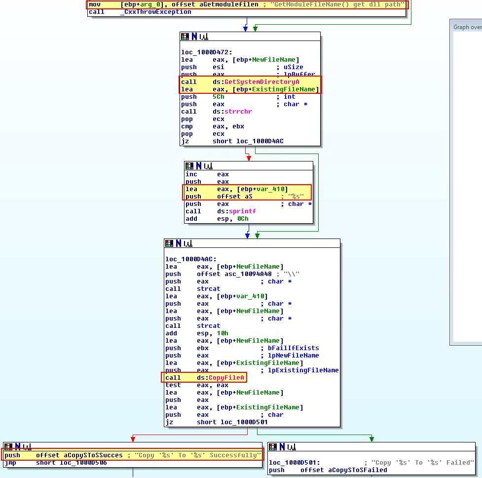

# Ques 1: What are the exports for this DLL?
Ta mở file .dll đó bằng các phần mềm peview rồi sau đó vào phần như ảnh sẽ thấy các hàm được export.


- InstallRT
- InstallSA
- InstallSB
- PSLIST
- ServiceMain
- StartEXS
- UninstallRT
- UninstallSA
- UninstallSB

Sau đó ta ngó qua 1 ít về bảng import sẽ thấy rất nhiều API được import.


# Ques 2:What happens after the attempted installation using rundll32.exe?
Đầu tiên ta sẽ mở Filter của phần mêm Promon nên và thêm các filter sau.


Sau đó ta có thể tạo bản backup nếu muốn. Sau đó ta chạy lệnh sau ở cmd:

```
rundll32.exe Lab17-02.dll,InstallRT
```

Sau khi chạy mình thấy khá thú vị là sau khi xem procmon thì sẽ thấy hàm đã tạo ra 2 file `xinstall.log và vmselfdel.bat`, và  sau đó xóa 1 file `vmselfdel.bat` đi và xóa cả file dll


Vì các tiến trình bị xóa bằng cmd.exe sau khi tạo file .bat, chúng ta có thể suy đoán rằng file `vmselfdel.bat` này là nguyên nhân. Sau đó chúng ta đến các 2 câu lệnh được đánh dấu ở trên chọn `Properties` -> `Process`


# Ques 3: Which files are created and what do they contain?
Mở file xinstall.log vẫn còn ở tring thư mục thì sẽ thấy 1 log của malware phát hiện ra đang được chạy trong 1 VM, và sau đó hủy bỏ việc cài đặt


Để phân tích thêm về nội dung của `vmselfdel.bat`, chúng ta sẽ sử dụng IDA, mở bảng `Export` và truy cập vào `installrt`. Chúng ta có thể thấy nội dùng được viết vào `xinstall.log ` tại hàm `sub_10003592`. Sau đó 1 hàm khác `sub_10005567`, mình nhìn qua giống phần tự xóa bản thân của file .bat và xóa file rundll32.exe ???

Tiến hành phân tích hàm `sub_10005567` thì tháy được việc tiến hành tạo file `vmselfdel.bat` bằng `fopen` ở đây và sẽ được ghi nội dung và và sẽ được chạy bằng lệnh `WinExec`

Sau đó ta sẽ dùng ollydbg2 để đặt breakpoint sau khi đóng file ví dụ như địa chỉ ` 0x1000563B`, muốn nhảy đến điểm đó dùng `ctrl + g` 


Sau khi đã đặt breakpoint rồi thì bấm phím `Alt + F6` để chạy `Call Dll export` sau đó sẽ hit vào breakpoint, lý do đặt breakpoint ở đó vì sẽ đặt ở giữa đoạn sau khi đã viết hết các lệnh và trước lệnh `WinExce` 


Sau đó sẽ bấm `Call export` rồi sẽ thấy file .bat hiện ra ở cùng thư mục với lab17-02.dll. Sau đó ta sẽ mở bằng notepad.


Phân tích nội dung của file ta thấy có lệnh `echo off` thể hiện rằng các lệnh của file này khi chạy ở cmd sẽ không được in ra. Tiếp đến là định nghĩa 1 hàm tên là `selfkill`!!! Hàm này sẽ loại bỏ các tất cả các thuộc tính của DLL có thể ngăn ngừa nó khỏi việc bị xóa trước khi cố gắng xóa file. Cuối cùng thì kiểm tra file dll còn tồn tại không, và nếu còn tồn tại thì sẽ chạy lại hàm `selfkill` trước khi cố gắng tự xóa bản thân file .bat. Nói tóm tắt là xóa cả dll và file bat!!!

# Ques 4:What method of Anti-VM is in use?
Trở lại IDA ta sẽ tiếp tục ở `InstallRT` và phân tích hàm `sub_10006196` được gọi trước khi chuỗi `Found Virtual Machine` được ghi ra đĩa. Nếu ta tìm references của hàm này ta sẽ thấy nó được gọi bởi tất cả hàm installation export, có thể suy đoán rằng đây là 1 hàm kiểm tra , sử dụng anti-vm.


Khi phân tích ta thấy có lệnh push có vẻ như liên quan đến custom handle được tạo ra trước khi có hàm check, khong biết có giống try /catch không ???


Bằng cách chuyển đổi các giá trị so sanh từ hex -> ascii sử dụng `R` ta thấy có 1 số điểm.


Từ trên ta thấy có lệnh `in` sẽ sử dụng data register `dx` ,được sử dụng cho việc I/O, ở trường họp này là `VX` , đến thanh ghi eax `VMXh`. Lệnh `in` sử dụng đặc biệt cho input từ cổng I/O tên cổng `VX` (đại diện cho VMware), và nếu nó được tìm thấy thì đảm bảo rằng magic number của Vmware tồn tại. Câu lệnh gán `ecx =0xAH` là kiểu như tham số để tiếp nhận version của Vmware từ port I/O ảo ???

Dựa vào hàm so sánh thì kết quả được trả về `al` trước khi hàm trả về giá trị 


Nhìn lạ hàm `InstallRT` ta có thể thấy lệnh `test al ,al ` để kiểm tra cờ ZF được bật là 1 nếu `al ==0`, ngược lại nếu `al` mang giá trị output thể hiện đang được chạy trong VM và malware sẽ không nhảy bởi lệnh `jz`


# Ques 5:How could you force the malware to install during runtime?
Để có thể bắt malware install trong lúc chạy, cái này lúc đầu mình chưa hiểu lắm đâu, nhưng khi xem thì mình thấy ngay lệnh jz ở trên nếu mình đổi ngược lại thì malware sẽ tiếp tục chạy, kiểu như mình vá lại .

Sửa đổi lệnh jz ở địa chỉ `0x1000D86E` thành `jnz`, hoặc có thể thay thế lệnh `in` tại `0x100061DB` thành NOP để bypass.

# Ques 6:How could you permanently disable the Anti-VM technique?
Ta thấy có lệnh nhảy có điều liện đến anti-vm , và trước đó có suwr dụng đến `off_10019034’`, tất cả cac sexport funcition đều có 


Nếu phân tích kĩ sẽ thấy  đây là string `[This is DVM]5` được lưu ở `off_10019034’` với 0xD được + vào pointer này. Sau khi + thì con trỏ sẽ trỏ đến `5` sau đó sẽ được convert thành số và sẽ được so sánh với số 0 ở thanh ghi eax. Khá là lạ chắc vì đây là bài lab chứ bình thường mình nghĩ không ai làm thế này cả. Cái này từ nhiên mình có thể bypass được luôn.

Có thể bypass bằng cách chỉnh sửa ở hex editor như HxD, ta sẽ sửa giá trị từ `5` thành `0`


Việc nàu giúp bypass được anti-vm check

# Question 7:How does each installation export function work?
Chúng ta có những installation exports trong malware sau:

- InstallRT (0x1000D847)
- InstallSA (0x1000DEC1)
- InstallSB (0x1000E892)

Sau khi đã bypass các anti-vm trên:

InstallRT sẽ cài đặt malware ở trong hàm `sub_1000D3D0`. Dưới đây là graph overview


InstallSA được cài đặt chức năng malware bên trong hàm `sub_1000D920`. Dưới đây là graph overview 


InstallSB được cài đặt chức năng malware bên trong hàm `sub_1000DF22`. Dưới đây là graph overview 


Chúng ta sẽ phân tích lần lượt
## InstallRT 
Đây là hàm export nhỏ nhất trong 3 hàm. Nhìn vào 1 nửa hàm ta thấy hàm sẽ copy malware vào thư mục system của window (ví dụ như `C:\Windows\System32.` ) bằng `GetSystemDirectoryA`

Phân tích ngắn gọn cách thức:
- Gọi `GetSystemDirectoryA` sẽ lưu địa chỉ vào `[ebp+Buffer]`
- Dùng hàm `strrchr` để tìm `\` cuối cùng của link `[ebp+Filename]`, khả năng đây chính là malware. Mục đích là lấy con trỏ đến `\`. Sau đó con trỏ += 1 để đến được kí tự đầu tiên của tên file.
- Sau đó sẽ dùng sprintf để lưu tên file vào biến `[ebp+Dest]`
- Sau đó dùng `strcat` để nối `\\` với `[ebp+Buffer]` để được ví dụ C:\Windows\System32\\.
- Sau đó dùng tiếp `strcat` để nối biến `[ebp+Dest]` vào cuối `[ebp+Buffer]` ta được ví dụ C:\Windows\System32\\mal.exe .
- Sau đó dùng `CopyFileA` để copy File vào đường dẫn đã nối ở trên.



Tiếp tục phân tích chúng ta sẽ để í đến hàm `sub_10003592` dường như là hàm tuần tự logging để record data về việc cài đặt có thành công hay không vào file `xinstall.log`. Bên  cạnh đó ta có thể tiếp tục phân tích ở dưới hàm export mẹ. Ta thấy đầu tiên hàm này lấy 1 tham số của 1 process , kiểm tra xem có tồn tại giá trị không bằng cách kiểm tra `strlen`. Nếu không có thì sẽ sử dụng `iexplore.exe,`. Sau đó sẽ tìm kiếm tiến trình ở hàm `sub_10004249`. Sau đó sử dụng ` VirtualAllocEx, WriteProcessMemory, and CreateRemoteThread ` để tạo remote thread trong process mục tiêu để load DLL


Chúng ta có thể chắc chắn bằng cách chạy hàm cài đặt từ binary đã patch(từ câu 6), và kiêm tra đây là Process Explorer để xem thêm nội dung của `xinstall.log`, hãy chạy lại lệnh cmd ở các câu trên trước và mở sẵn IE lên.


Từ đây ta có thể nói rằng `InstallRT` giống như `Install remote thread` và được sử dụng để load DLL vào remote thread bên trong 1 tiến trình được sử dụng như 1 là tham số hoặc nếu ko có tham số thì mặc định tiến trình là IE.

## InstallSA
Bắt đầu phân tích từ hàm `sub_1000D920` sau khi bỏ qua hàm check đã được bypass, chúng ta có thể thấy 1 chuỗi mặc định là `Irmon` xuất hiện và được tìm kiếm để xem nếu tồn tại 1 service chạy bằng registry ??? Mình chưa hiểu chỗ này lắm 


Tiếp tục phân tích sẽ thấy nếu sẽ có 1 đoạn check trong `HKEY_LOCAL_MACHINE\SOFTWARE\Microsoft\Windows NT\CurrentVersion\Svchost”` với giá trị `netsvcs` sau đó cũng được check tiếp nếu có data == đối số đã cho trong  `netsvcs`.


Nếu mà đối số đã cho `Irmon` tồn tại ở key này , malware sẽ cố gắng cài đặt 1 server ở `HKEY_LOCAL_MACHINE\SYSTEM\CurrentControlSet\Services”` với tên và đảm bảo đây là 1 phần của `HKEY_LOCAL_MACHINE\SOFTWARE\Microsoft\Windows NT\CurrentVersion\Svchost` với option `%SystemRoot%\\System32\\svchost.exe -k ne`


Như đã thể hiện ở trên , 1 service được tạo ra với mô tả ` System Services` ở biến `DisplayName`. Sau khi service được tạo, hàm sẽ cố gắn set service DLL liên kết với service vừa được tạo bằng cách mở 1 handle tới tạo 1 subkey `parameters'` của registry key của service vừa tạo.


Có 1 điều khá ngạc nhiên là chỗ này đang cố gắng set ServiceDLL thành link đầy đủ của Lab17-02.dll cái mà đang chạy


Nó không bao giờ thực sự copy DLL đến thư mục hệ thống nơi mà nó cố gắng chạy từ đó, và cũng giống như service không bao giờ cài đặt hợp lí khi sử dụng installSA???? Mình cũng chưa hiểu í tác giả nói lắm 


Cuối cùng ta có thể iểm tra suy đoán , phân tích bằng cách cài đặt malware sử dụng `InstallSA`export và nhìn vào register service


Từ đây ta có thể đoán ra rằng `InstallSA` giống như `Install Service A` và được sử dụng để install malware as service dll vào 1 service được chỉ định

## InstallSB
Trước khi phân tích hàm `‘sub_1000DF22` là mấu chốt chính của `InstallSB`, chúng ta hãy phân tích hàm xảy ra trước là  `sub_10005A0A`


CHúng ta thấy có `sfc_os.dll or sfc.dll` được load để cố gắng tắt chức năng `Windows File Protection` thông qua `SfcTerminateWatcherThread` export `2` là ordinal trong dll

Phân tích phần bắt đầu của `‘sub_1000DF22` cho thấy nó khá giống với `installSA` nhưng chỉ khác ở chỗ lần này nó tìm kiếm tên service == `NtmsSvc` nếu không có tham số nào được truyền???


Tiếp theo ta lướt xuống dưới sẽ thấy đang kiểm tra các service của `netsvcs` nếu 1 đối số được chỉ định

Nếu chúng ta tiếp tục phân tích tiếp nếu nếu back up service đang tồn tại bằng 1 service mới `ServiceMainbak` trước khi cài đặt bản thân nó. Việc này giống nhưu xóa, loại bỏ việc cấy ghép ở 1 thời gian khác và ngăn ngừa ảnh hưởng  đến hệ thống. Mình chưa hiểu í tác giả ở đoạn này lắm vì chưa thấy mục đích backup ở đâu cả.


Tiếp tục nhìn xuống dưới ta sẽ thấy có 2 nhánh phân chia, 1 nhánh giống nhưu update phần cài đặt của malware, cá còn lại thì làm mới 1 infection.


Chúng ta sẽ đi theo cái làm mới, sẽ thấy có bằng chứng hàm này sẽ copy malware và thiết lập bám trụ vào form của 1 service 


Điều thú vị ở đây là ở đây có 1 hàm check khác call đến `sub_1000D10D` trước khi call đến `sub_1000C564`


Nếu chúng ta phân tích `‘sub_1000D10D’` chúng ta sẽ thấy kĩ thuật giống InstallRT, sử dụng remote threat để inject vào 1 tiến trình mục tiêu để chạy dll.


Thú vị ở chỗ tên process được inject vào, ở đây thì process được chỉ định được lưu vào ` [ebp-24h]`. Nếu ta quay lại lúc chia làm 2 nhánh sẽ thấy đây là thành phần PID của `svchost.exe` được chứa trong `‘sub_1000D26B’.`


`sub_1000C564` giống như việc bắt đầu service độc hại mà chúng ta vừa cố gắng setup payload

Từ đây chúng ta có thể giả định răng InstallSB giống như Install service B để install malware as a service dll vào 1 service được chỉ định bên trong `netsvcs`, hoặc 1 cái service tồn tại `NtmsSv` nếu ko có tham sô truyền vào . Sau đó cố gắng inject vào svhost.exe

Kết luận: bài này với mình hiện tại quá khó để phân tích kĩ =((((, được mở mang tầm mắt rất nhiều , học hỏi được các kĩ thuật hay, khá thực tế.