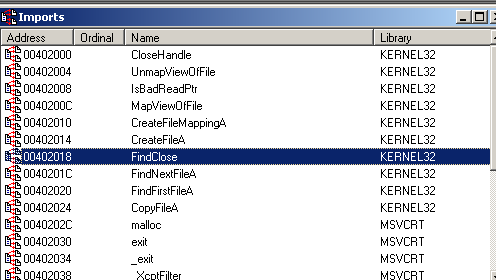

# LAB 1-1

Questions
## 1.Upload the files to http://www.VirusTotal.com/ and view the reports. Does either file match any existing antivirus signatures
[Lab01-01.exe](https://www.virustotal.com/gui/file/58898bd42c5bd3bf9b1389f0eee5b39cd59180e8370eb9ea838a0b327bd6fe47/detection)

- 57/72 detecction rate
- Match popular label `trojan.ulise/aenjaris`

[Lab01-01.dll](https://www.virustotal.com/gui/file/f50e42c8dfaab649bde0398867e930b86c2a599e8db83b8260393082268f2dba/summary)
- 46/72 detection rate
- Match popular label `trojan.skeeyah/doina`
# 2. When were these files compiled?
Sử dụng PEview, đưa file vào và xem ở đường link: IMAGE_NT_HEADER -> IMAGE_FILE_HEADER -> Time date Stamp

`Lab01-01`

Time: 2010/12/19 Sun 16:16:19 UTC

`Lab01-01.dll`

Time: 2010/12/19 Sun 16:16:38 UTC 

#  3. Are there any indications that either of these files is packed or obfuscated? If so, what are these indicators?
Không có bằng chứng cho thấy các file đã bị packed or obfuscated bằng cách sử dụng `PEid`, các file được complied băng Microsoft Visual C++ 6.0

`Lab01-01.exe`


`Lab01-01.dll`


Sử dụng `Peview` để nhìn vào virtual size và raw size của các file, link: IMAGE_NT_HEADERS ->  IMAGE_SECTION_HEADER .text
`Lab01-01.exe`


Dùng IDA để xem `Strings window` để xem có bị pack hay không
`Lab01-01.exe`


`Lab01-01.dll`


Còn việc check xem có bị obfucation ở winxp không với mình khá khó và lâu nên mình giả định ở đây là không bị obfucation.
# 4. Do any imports hint at what this malware does? If so, which imports are they?
`Lab01-01.exe`
- Dùng IDA để xem các thư viện import thì thấy 1 số API, dùng KERNEL32.dll
    - CopyFile
    - FindFirstFile
    - FindNextFile
    - UnmapViewOfFile, IsBadReadPtr, MapViewOfFile, CreateFileMappingA
Các API trên có thể sử dụng để tìm, đọc, copy file
Ở `strings window` có thấy từ `Lab01-01.dll`, khả năng cao có liên quan hoặc liên kết đến `Lab01-01.dll`.
Khi dùng Depends thì không thấy `exe` liên kết tĩnh `dll`


`Lab01-01.dll`
- Dùng IDA, Denpends để xem các thư viện import thì thấy 1 số API, dùng KERNEL32.dll, WS2_32.dll and MSVCRT.dll.
1 số API, functions đáng chú ý:
    - KERNEL32.dll:Sleep, CreateProcessA, CreateMutexA, OpenMutexA, CloseHandle.
    -  WS2_32.dll:socket, WSAStartup, inet_addr, connect, send, shutdown, recv, closesocket, WSACleanup, htons.


---
## Phân tích ngoài lề
Khi nhìn vào mã giả của IDA ver 6.x thì mình thấy không đúng lắm , ví dụ như 
```
v5 = MapViewOfFile(v4, 4u, 0, 0, 0);
v6 = (int)v5;
```
Bạn có thể thấy khi `MapViewOfFile` thành công sẽ trả về con trỏ void * suy ra v5 phải là con trỏ void* và v6 cũng vậy, hãy nhìn vào code asm và khai báo ở mã giả đúng ở chỗ v6 là thanh ghi esi


Tiếp theo là `mov     edi, [esi+3Ch]` hay `v45 = v6 + *(_DWORD *)(v6 + 60)` 
lúc này esi+3C là nơi chứa `e_lfnew` trong đó nội dung chính là offset tới `IIMAGE_NT_HEADERS` 
Ta có thể dùng `CFF explorer` để xem 


Khi phân tích thì thấy `export directory` của kernel32.dll nằm ở section .text còn của Lab01-01.dll nằm ở r.data